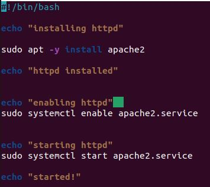
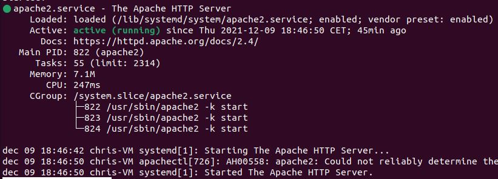
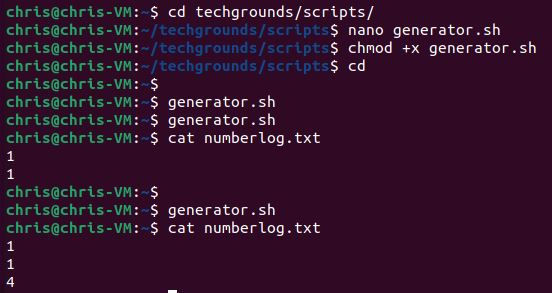

# Bash scripting
De standaard opdrachtregelinterface in Linux wordt een Bash-shell genoemd. Je hebt al interactie gehad met Linux met behulp van opdrachten in deze shell.
Een Bash-script is een reeks opdrachten die in een tekstbestand zijn geschreven. U kunt meerdere opdrachten achter elkaar uitvoeren door alleen het script uit te voeren.
Extra logica kan worden toegepast met onder andere het gebruik van variabelen, voorwaarden en lussen.

Om het script te kunnen uitvoeren, moet een gebruiker machtigingen hebben om het bestand (x) uit te voeren.
Linux kan het script alleen vinden als je de padnaam opgeeft, of als je het pad toevoegt aan de map waarin het script zich bevindt aan de variabele PATH.

## Key-terms
- __bashrc__ = bashrc file is a script file that's executed when a user logs in. The file itself contains a series of configurations for the terminal session.
- __$PATH__ = a environment variable that is file location-related.
- __$HOME__ = an environment variable that contains the location of your home directory.
- __$RANDOM__ = a shell variable that is used to generate random integers.

## Opdracht
- Maak een map met de naam 'scripts'. Plaats alle scripts die je maakt in deze map.
- Voeg de scriptmap toe aan de PATH-variabele.
- Maak een script dat een regel tekst aan een tekstbestand toevoegt wanneer het wordt uitgevoerd.
- Maak een script dat het httpd-pakket installeert, httpd activeert en httpd inschakelt. Ten slotte zou je script de status van httpd in de terminal moeten afdrukken.
- Maak een script dat een willekeurig getal tussen 1 en 10 genereert, dit opslaat in een variabele en het getal vervolgens aan een tekstbestand toevoegt.

### Gebruikte bronnen
- [How to add directory to system path in Linux](https://www.computerhope.com/issues/ch001647.htm)
- [How to install Apache on Ubuntu 20.04 LTS](https://www.cyberciti.biz/faq/how-to-install-apache-on-ubuntu-20-04-lts/)
- [Generate a random number in bash](https://linuxhint.com/generate-random-number-bash/)

### Ervaren problemen
Paths werkte niet, blijkbaar moet je eerst files rechten geven, moeilijk te vinden dat dit nodig was, wel veel geleerd van paths.
### Resultaat

##### Maak een map met de naam 'scripts'. Plaats alle scripts die je maakt in deze map.
`mkdir scripts`

##### Voeg de scriptmap toe aan de PATH-variabele.

`vim ~/.bashrc`

`export PATH=$PATH:$HOME/techgrounds/scripts`

`. ~/.bashrc` | `source ~/.bashrc`

##### Maak een script dat een regel tekst aan een tekstbestand toevoegt wanneer het wordt uitgevoerd.

`nano tekstwriter.sh`

`./tekstwriter.sh`

##### Maak een script dat het httpd-pakket installeert, httpd activeert en httpd inschakelt. Ten slotte zou je script de status van httpd in de terminal moeten afdrukken.

`nano launcher.sh`

`./launcher.sh`

##### Maak een script dat een willekeurig getal tussen 1 en 10 genereert, dit opslaat in een variabele en het getal vervolgens aan een tekstbestand toevoegt.

`nano generator.sh`

`./generator.sh`

