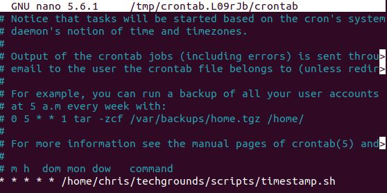
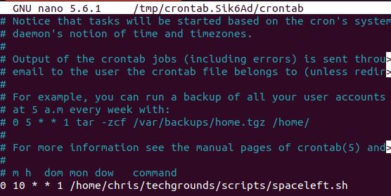

# Cron taken
Er kunnen processen zijn die u volgens een regelmatig schema wilt uitvoeren. U wilt bijvoorbeeld elk uur de beschikbare schijfruimte naar een logbestand schrijven. Of misschien wilt u elke 2e dag van de maand op systeemupdates controleren.

Dit soort taken kunnen worden geautomatiseerd met behulp van Cron taken.

## Key-terms
- df = disk free
- cron = a clock daemon
- crontab = a UNIX command that creates a table or list of commands

## Opdracht
- [Maak een Bash-script dat de huidige datum en tijd naar een bestand in uw thuismap schrijft.](#maak-een-bash-script-dat-de-huidige-datum-en-tijd-naar-een-bestand-in-uw-thuismap-schrijft)
- [Registreer het script in je crontab zodat het elke minuut wordt uitgevoerd.](#registreer-het-script-in-je-crontab-zodat-het-elke-minuut-wordt-uitgevoerd)
- [Maak een script dat beschikbare schijfruimte schrijft naar een logbestand in ‘/var/logs’. Gebruik een cron-job zodat deze wekelijks wordt uitgevoerd.](#maak-een-script-dat-beschikbare-schijfruimte-schrijft-naar-een-logbestand-in-varlogs-gebruik-een-cron-job-zodat-deze-wekelijks-wordt-uitgevoerd)

### Gebruikte bronnen
- [How to Set Up a Cron Job in Linux](https://phoenixnap.com/kb/set-up-cron-job-linux)
- [How to Check Disk Space in Linux](https://phoenixnap.com/kb/linux-check-disk-space)
- [crontab guru](https://crontab.guru/)

### Ervaren problemen
crontab had geen sudo rights voor `logs`.

### Resultaat

##### Maak een Bash-script dat de huidige datum en tijd naar een bestand in uw thuismap schrijft.

`nano timestamp.sh`

`timestamp.sh`

##### Registreer het script in je crontab zodat het elke minuut wordt uitgevoerd.

`crontab -e`

##### Maak een script dat beschikbare schijfruimte schrijft naar een logbestand in ‘/var/logs’. Gebruik een cron-job zodat deze wekelijks wordt uitgevoerd.

`nano spaceleft.sh`

`sudo crontab -e`

`cat /var/logs`

