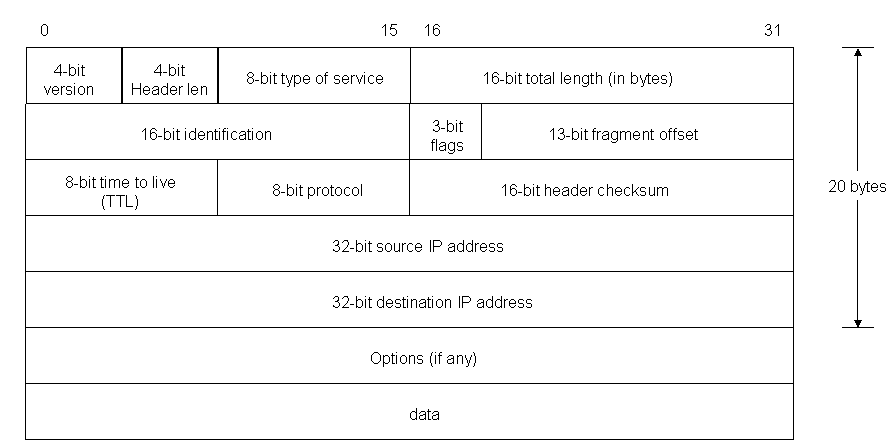
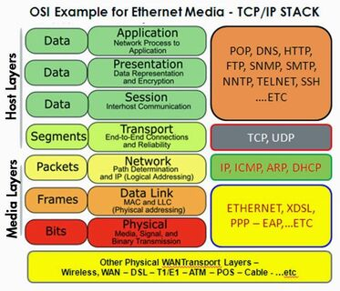
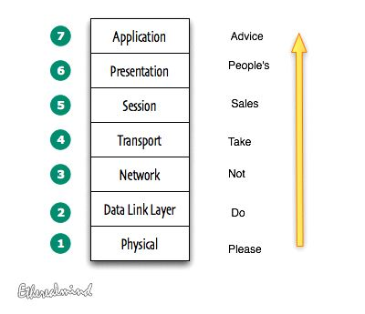

# Protocols
Een netwerk protocol is een afspraak die wij mensen gemaakt hebben over hoe computers met elkaar communiceren. Deze afspraken maken het mogelijk dat het Internet kan bestaan, zonder dat je voor iedere verbinding een andere standaard moet aanhouden.
Het OSI-model is een goed hulpmiddel om te beschrijven waar een protocol ‘leeft’ en wat het doel is van een protocol. Vaak genoeg ‘leeft’ een protocol in meerdere lagen van het OSI-model.

Twee protocols die in laag 4 ‘leven’ is TCP en UDP. Deze protocols zijn verantwoordelijk voor het transport van internet pakketten. 
TCP, veel gebruikt op het web, heeft een aantal stappen waarin er zeker gesteld wordt dat de verbinding gemaakt kan worden en om zeker te zijn dat alle data is overgekomen. Dit is ook wel de ‘three-way handshake’ genoemd. Dit maakt TCP erg betrouwbaar.
UDP heeft een hele andere aanpak: ‘fire and forget’. UDP maakt geen zorgen over of een pakketje aankomt. Dit maakt dit protocol onbetrouwbaar, maar wel veel sneller. UDP wordt veel gebruikt in omstandigheden waar snelheid belangrijker is dan verbinding. Zoals de video data van een Zoom-call.

Protocols die ‘leven’ in hogere lagen van het OSI-model hebben meestal specifieke toepassingen. HTTP(s) of SSH zijn enkele voorbeelden van hogere level protocols.

Onderdeel van de afspraken die wij gemaakt hebben over protocols is dat deze meestal een ‘standaard poort’ hebben. Voor SSH is dit poort 22.

## Key-terms

## Opdracht
- Begrijp hoe een HTTPS TCP/IP-pakket opgebouwd is
- Begrijp wie bepaalt welke protocols wij gebruiken en wat je zelf moet doen om een nieuw protocol te introduceren.
- Identificeer op zijn minst één protocol per OSI-laag.
- Facebook was recent een lange tijd niet beschikbaar. Ontdek waarom. Tip: BGP.

### Gebruikte bronnen
- [Wat is het OSI-model?](https://www.strato.nl/server/wat-is-het-osi-model/)
- [The OSI Model - Features, Principles and Layers](https://www.studytonight.com/computer-networks/complete-osi-modela)
- [OSI Model Layers and Protocols in Computer Network](https://www.guru99.com/layers-of-osi-model.html#14)
- [TCP/IP Model: What are Layers & Protocol? TCP/IP Stack](https://www.guru99.com/tcp-ip-model.html)
- [What Is a Network Protocol, and How Does It Work?](https://www.comptia.org/content/guides/what-is-a-network-protocol)

### Ervaren problemen

### Resultaat

### Vier lagen van het TCP/IP-model

- __toepassingslaag (Application Layer):__
1. De applicatielaag helpt u bij het identificeren van communicatiepartners, het bepalen van de beschikbaarheid van bronnen en het synchroniseren van communicatie.
2. het bepalen van de beschikbaarheid van bronnen en het synchroniseren van communicatie.
3. Het stelt gebruikers in staat in te loggen op een host op afstand.
4. Deze laag biedt verschillende e-maildiensten.
5. Deze toepassing biedt gedistribueerde databasebronnen en toegang voor globale informatie over diverse objecten en diensten.

- __transportlaag (Transport Layer)__
1. Het verdeelt het ontvangen bericht van de sessielaag in segmenten en nummert ze om een reeks te maken.
2. De transportlaag zorgt ervoor dat het bericht bij het juiste proces op de doelmachine wordt afgeleverd.
3. Het zorgt er ook voor dat het volledige bericht zonder fouten aankomt, anders moet het opnieuw worden verzonden

- __internetlaag (Internet Layer)__
1. Routing protocollen
2. Beheer van multicastgroepen
3. toewijzing van adressen op de netwerklaag.

- __netwerklaag (Network Interface)__

Een netwerklaag is een combinatie van de datalijn en gedefinieerd in het artikel van het OSI-referentiemodel. Deze laag definieert hoe de gegevens fysiek door het netwerk moeten worden verzonden. Het bevat ook hoe bits optisch moeten worden gesignaleerd door hardware-apparaten die rechtstreeks worden gekoppeld aan een netwerkmedium, zoals coaxiale, optische, coaxiale of glasvezelkabels.

### IP Header

- 4 bits die de versie bevatten, die specificeert of het een IPv4 of IPv6 pakket is,
- 4 bits die de Internet Header Length bevatten, dat is de lengte van de header in veelvouden van 4 bytes (bijv. 5 betekent 20 bytes).
- 8 bits die het Type of Service bevatten, ook wel Quality of Service (QoS) genoemd, dat beschrijft welke prioriteit het pakket moet hebben,
- 16 bits die de lengte van het pakket in bytes bevatten,
- 16 bits die een identificatietag bevatten om het pakket uit verschillende fragmenten te helpen reconstrueren,
- 3 bits. De eerste bevat een nul, gevolgd door een vlag die aangeeft of het pakket gefragmenteerd mag worden of niet (DF of Don't fragment), en een vlag die aangeeft of er meer fragmenten van een pakket volgen (MF of More Fragments)
- 13 bits die de fragment offset bevatten, een veld om de positie van het fragment binnen het oorspronkelijke pakket te bepalen
- 8 bits die de Time to live (TTL) bevatten, dat is het aantal hops (router, computer of apparaat langs een netwerk) dat het pakket mag passeren voordat het sterft (een pakket met een TTL van 16 mag bijvoorbeeld 16 routers passeren om bij zijn bestemming te komen voordat het wordt weggegooid),
- 8 bits die het protocol bevatten (TCP, UDP, ICMP, enz.)
- 16 bits die de Header Checksum bevatten, een getal dat wordt gebruikt bij foutdetectie,
- 32 bits die het bron IP adres bevatten,
- 32 bits voor het bestemmingsadres.

### Over Protocollen
Netwerkprotocollen worden door verschillende netwerk of informatietechnologie-organisaties opgesteld volgens industriële normen.

De volgende groepen hebben verschillende netwerkprotocollen gedefinieerd en gepubliceerd:

- [Het Institute of Electrical and Electronics Engineers](https://www.ieee.org/) (IEEE)
- [De Internet Engineering Task Force](https://www.ietf.org/) (IETF)
- [De Internationale Organisatie voor Normalisatie](https://www.iso.org/home.html) (ISO)
- [De Internationale Telecommunicatie Unie](https://www.itu.int/en/Pages/default.aspx) (ITU)
- [Het World Wide Web Consortium](https://www.w3.org/) (W3C)

Hoewel netwerkprotocolmodellen over het algemeen op vergelijkbare manieren werken, is elk protocol uniek en werkt het op een specifieke manier die wordt beschreven door de organisatie die het heeft gecreëerd.

### OSI Layer

#### Toepassingsgeoriënteerde lagen

De bovenste lagen van het OSI-referentiemodel worden toepassingsgeoriënteerde lagen genoemd. Men maakt onderscheid tussen de toepassingslaag, de presentatielaag en de sessielaag.

- __Laag 7 – toepassingslaag (application layer):__
- Protocollen: `SMTP, HTTP, FTP, POP3, SNMP`
1. De Applicatielaag is de bovenste laag.
2. Het overbrengen van bestanden en het distribueren van de resultaten aan de gebruiker wordt ook in deze laag gedaan.
3. Deze laag bevat voornamelijk applicatieprogramma's om te reageren op het ontvangen en te verzenden van gegevens.

- __Laag 6 – presentatielaag (presentation layer):__
- Protocollen: `MPEG, ASCH, SSL, TLS`
1. De presentatielaag zorgt ervoor dat de gegevens zodanig worden verzonden dat de ontvanger de informatie (gegevens) begrijpt en in staat zal zijn de gegevens te gebruiken.
2. Terwijl de gegevens worden ontvangen, transformeert de presentatielaag de gegevens om klaar te zijn voor de toepassingslaag.
3. De talen (syntaxis) van de twee communicerende systemen kunnen verschillend zijn. Onder deze voorwaarde speelt de presentatielaag de rol van vertaler.
4. Het voert gegevenscompressie, gegevenscodering, gegevensconversie enz. uit.

- __Laag 5 – sessielaag (session layer):__
- Protocollen: `NetBIOS, SAP`
1. De Session Layer beheert en synchroniseert het gesprek tussen twee verschillende applicaties.
2. Overdracht van gegevens van bron naar bestemming in de sessielaag Gegevensstromen worden gemarkeerd en correct opnieuw gesynchroniseerd, zodat de uiteinden van de berichten niet voortijdig worden afgebroken en gegevensverlies wordt voorkomen.

#### Transportgeoriënteerde lagen
Op de drie toepassingsgeoriënteerde lagen van het OSI-model volgen vier transportgeoriënteerde lagen. Men maakt onderscheid tussen de transportlaag, de netwerklaag, de datalinklaag en de fysieke laag.

- __Laag 4 – transportlaag (transport layer):__ 
- Protocollen: 	`TCP, UDP`
1. De transport Layer beslist of de gegevensoverdracht op een parallel pad of op een enkel pad moet plaatsvinden.
2. Functies zoals multiplexing, segmentering of splitsing van de gegevens worden door deze laag uitgevoerd.
3. Het ontvangt berichten van de bovenliggende sessielaag, zet het bericht om in kleinere eenheden en geeft het door aan de netwerklaag.
4. De transportlaag kan zeer complex zijn, afhankelijk van de netwerkvereisten.
5. De transportlaag verdeelt de boodschap (data) in kleine eenheden zodat ze efficiënter worden afgehandeld door de netwerklaag.

- __Laag 3 – netwerklaag (network layer):__ 
- Protocollen: `IPV5, IPV6, ICMP, IPSEC, ARP, MPLS.`
1. De netwerklaag leidt het signaal via verschillende kanalen van het ene knooppunt naar het andere.
2. Het functioneert als een netwerkcontroller. Het beheert het subnet verkeer.
3. Het bepaalt welke route gegevens moeten volgen.
4. Het verdeelt de uitgaande berichten in pakketjes en voegt de inkomende pakketjes samen tot berichten voor hogere niveaus.

- __Laag 2 – datalinklaag (data link layer):__ 
- Protocollen:` RAPA, PPP, Frame Relay, ATM, Fiber Cable, etc.`
1. De datalinklaag synchroniseert de informatie die over de fysieke laag moet worden verzonden.
2. De belangrijkste functie van deze laag is ervoor te zorgen dat de gegevensoverdracht over de fysieke laag foutloos verloopt van het ene knooppunt naar het andere.
3. Het opeenvolgend verzenden en ontvangen van dataframes wordt door deze laag beheerd.
4. Deze laag verzendt en verwacht bevestigingen voor ontvangen en verzonden frames.
5. Deze laag is een logic laag tussen twee knooppunten en het regeling van het frameverkeer over het netwerk. Het geeft een signaal aan het zendende kooppunt om te stoppen, wanneer de frame buffers vol zijn.

- __Laag 1 – fysieke laag (physical layer):__ 
- Protocollen:` RS232, 100BaseTX, ISDN, 11.`
1. De fysieke laag is de onderste laag van het OSI-model. 
2. Het activeert, onderhoudt en deactiveert de fysieke verbinding.
3. Het is verantwoordelijk voor de verzending en ontvangst van de ongestructureerde ruwe data via het netwerk.
4. Spanningen en datasnelheden die nodig zijn voor transmissie worden gedefinieerd in de fysieke laag.
5. Het zet de digitale/analoge bits om in elektrische signalen of optische signalen.
6. Codering van gegevens vindt ook in deze laag plaats.

