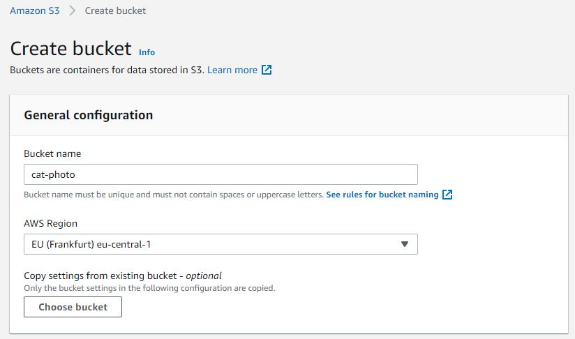
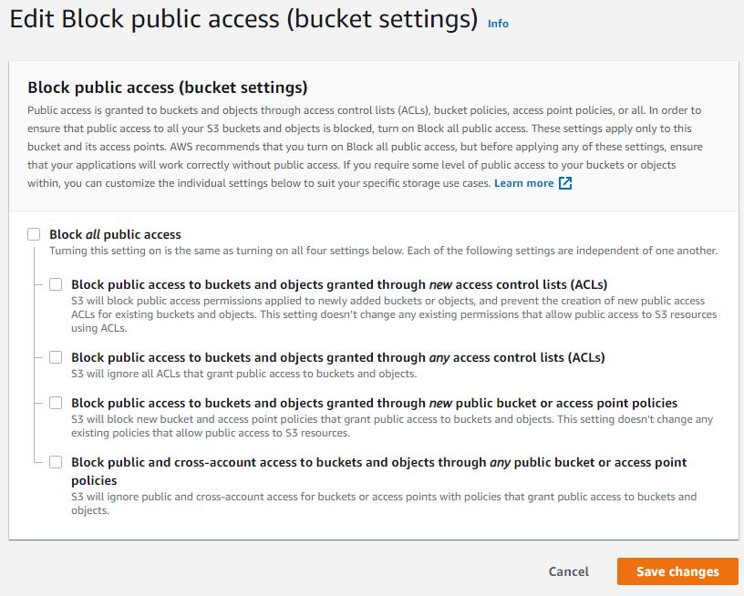
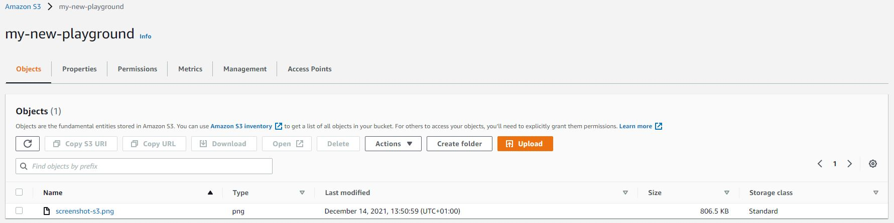
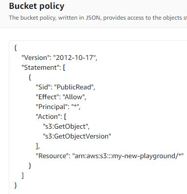
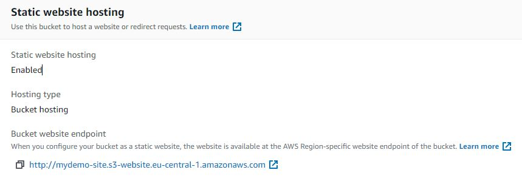
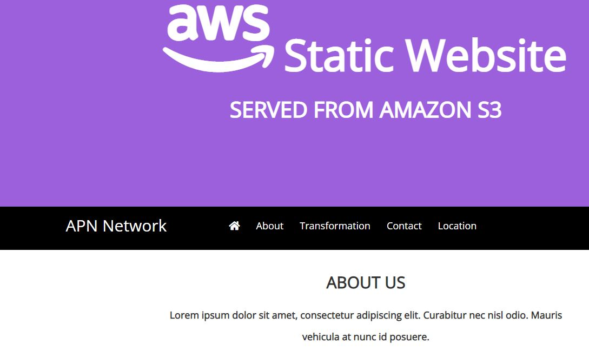

# Simple Storage Service (S3)
AWS biedt objectgebaseerde opslag in de vorm van S3. S3 maakt gebruik van emmers als container voor objecten. Een enkel object in S3 heeft een maximale grootte van 5TB. De totale grootte van een emmer is echter vrijwel onbeperkt.

Bucketnamen moeten wereldwijd uniek zijn. Dat wil zeggen dat zelfs andere AWS-accounts in verschillende regio's niet dezelfde bucketnaam kunnen delen. Buckets en objecten binnen buckets zijn toegankelijk via een URL.

Het bucketbeleid fungeert als een toegangscontrolelijst. Gegevens kunnen worden versleuteld voor nog meer bescherming.

Objecten worden automatisch gekopieerd binnen een regio, zodat er altijd minimaal drie exemplaren beschikbaar zijn. Deze redundantie verhoogt de beschikbaarheid en duurzaamheid van objecten die zijn opgeslagen in S3 aanzienlijk.

Er zijn 4 opslagklassen:
- S3 Standaard
- S3 Standaard-IA
- S3 Eén-zone IA
- S3 Gletsjer
Er is ook een S3 Glacier Deep-archief, een subklasse van S3 Glacier. En Intelligent Tiering, dat meer een hulpmiddel voor kostenoptimalisatie is dan een klasse op zich.
Opslagklassen verschillen in beschikbaarheid, duurzaamheid, ophaaltijd en kosten.

In S3 betaal je voor:
- GB's opslagruimte per maand
- Transfer OUT naar buiten de regio
- PUT-, COPY-, POST-, LIST- en GET-verzoeken

U betaalt niet voor:
- Transfer IN naar Amazon S3
- Breng OUT over van S3 naar CloudFront of EC2 in dezelfde regio

Naast het opslaan van gegevens voor allerlei doeleinden (big data, opslaan van video's, archivering, etc.), heeft S3 nog een andere use case: het hosten van statische websites.
## Key-terms

## Opdracht
- Start uw sandbox-lab en open de AWS-console.
- Navigeer naar het S3-menu.
- Maak een nieuwe bucket met de volgende vereisten:
  - Regio: Frankfurt (eu-central-1)
  - Openbare toegang ingeschakeld
- Upload een kattenfoto naar je emmer.
- Deel de object-URL van uw kattenfoto met een peer. Zorg ervoor dat ze de foto kunnen zien.

- Maak een nieuwe emmer aan met de volgende vereisten:
  - Regio: Frankfurt (eu-centraal-1)
  - Publieke toegang ingeschakeld
- Upload de vier bestanden die samen de demo website van AWS vormen.
- Schakel statische website hosting in.
- Deel de bucket website endpoint met een peer. Zorg ervoor dat zij de website kunnen zien.

### Gebruikte bronnen
[Bucket policy examples](https://docs.aws.amazon.com/AmazonS3/latest/userguide/example-bucket-policies.html)
### Ervaren problemen

### Resultaat

### Oefening 1

- Start uw sandbox-lab en open de AWS-console.
- Navigeer naar het S3-menu.
- Maak een nieuwe bucket met de volgende vereisten:
  - Regio: Frankfurt (eu-central-1)
  - Openbare toegang ingeschakeld

- Upload een kattenfoto naar je emmer.
- Deel de object-URL van uw kattenfoto met een peer. Zorg ervoor dat ze de foto kunnen zien.

webpagina:
https://my-new-playground.s3.eu-central-1.amazonaws.com/screenshot-s3.png

### Oefening 2

- Maak een nieuwe emmer aan met de volgende vereisten:
  - Regio: Frankfurt (eu-centraal-1)
  - Publieke toegang ingeschakeld
- Upload de vier bestanden die samen de demo website van AWS vormen.
- Schakel statische website hosting in.
- Deel de bucket website endpoint met een peer. Zorg ervoor dat zij de website kunnen zien.

webpagina: http://mydemo-site.s3-website.eu-central-1.amazonaws.com/

