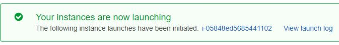
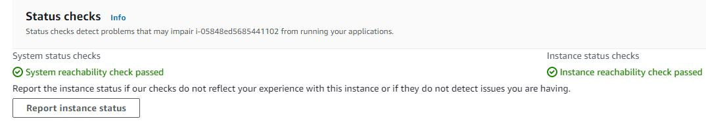
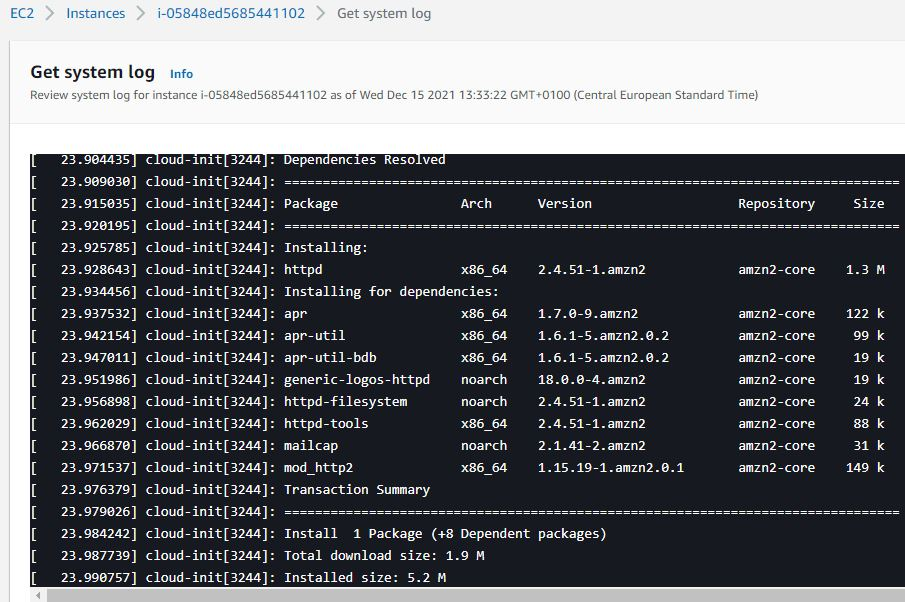
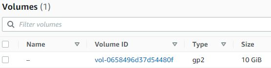
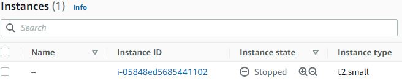
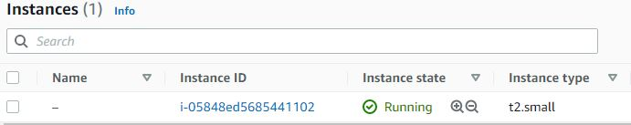
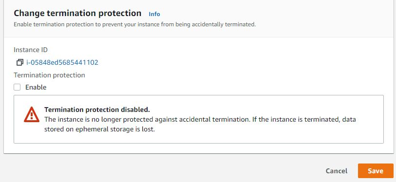
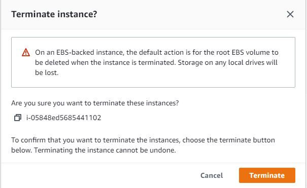
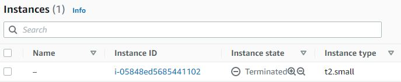

# Elastic Compute Cloud (EC2)
De service waarmee je Virtual Machines in AWS kunt draaien heet EC2. Deze VM's kunnen worden gebruikt voor alles waarvoor een gewone server wordt gebruikt. Omdat ze zich op een externe locatie bevinden, moet verbinding met de machine via internet worden gedaan. Voor een verbinding met Linux machines maak je gebruik van het Secure Shell (ssh) protocol. Voor een verbinding met Windows-machines maak je gebruik van het Remote Desktop Protocol (RDP).

Wanneer u een EC2-instantie maakt, moet u eerst een Amazon Machine Image (AMI) selecteren. Een AMI is een blauwdruk voor uw machine. Het bevat onder andere een sjabloon voor het besturingssysteem.

EC2 kan verschillende groottes hebben, instantietypes genoemd. Elk instantietype heeft een ander aantal (virtuele) CPU's, geheugen en netwerkprestaties.

Voor het rootvolume kan een instantie Elastic Block Store (EBS) of instantieopslag gebruiken, afhankelijk van het type. Instantieopslag staat bekend als kortstondige opslag, terwijl EBS bekend staat als permanente opslag.

Elke instantie heeft een beveiligingsgroep. Dit is een stateful firewall die werkt met expliciete regels voor toestaan. Door de Security Group-service te gebruiken, hoeft u zich geen zorgen te maken over firewalls op OS-niveau.

Met Gebruikersgegevens kun je een (bash)script specificeren dat bij het opstarten wordt uitgevoerd. Dit is een manier om snel servers te configureren zonder in te loggen en zonder handmatig werk.

- De prijs van een EC2-instantie is afhankelijk van het instantietype, de AMI, de regio waarin het zich bevindt, het aantal seconden dat het actief is en het type aankoop dat u doet.
Instanties op aanvraag zijn de duurste optie, maar ze zijn ook het meest flexibel.
- Gereserveerde exemplaren bieden een grotere korting, afhankelijk van hoeveel u vooraf betaalt. U kunt exemplaren slechts voor 1 of 3 jaar reserveren.
- Spot-instanties worden over het algemeen als de goedkoopste beschouwd, maar hun beschikbaarheid is afhankelijk van de vraag, dus ze zijn niet altijd betrouwbaar.

## Key-terms

### Oefening 1
- Start uw sandbox-lab en open de AWS-console.
- Navigeer naar het EC2-menu.
- Start een EC2-instantie met de volgende vereisten:
  - AMI: Amazon Linux 2 AMI (HVM), SSD-volumetype
  - Instantietype: t2.micro
  - Standaard netwerk, geen voorkeur voor subnet
  - Beëindigingsbeveiliging: ingeschakeld
    - Gebruikersgegevens:
  
          #!/bin/bash
          yum -y install httpd
          systemctl enable httpd
          systemctl start httpd
          echo '<html><h1>Hello From Your Web Server!</h1></html>' > /var/www/html/index.html
  - Rootvolume: SSD voor algemeen gebruik, Grootte: 8 GiB
  - Nieuwe beveiligingsgroep:
  - Naam: Webserver SG
  - Regels: Sta SSH, HTTP en HTTPS overal toe
  - Key Pair: vockey (deze is te downloaden vanuit de sandbox lab-omgeving)
  
### Oefening 2
- Wacht tot de Status Checks uit de initialisatiefase zijn. Wanneer je op de Status Checks tab klikt, zou je moeten zien dat de System reachability en de Instance reachability checks geslaagd zijn.
- Zoek de EC2 systeem logs. Controleer of het HTTP pakket is geïnstalleerd.

### Oefening 3
- Stop uw EC2 instance (niet beëindigen).
- Verander het instance type in een t2.small.
- Verander de grootte van het EBS volume in 10 GiB.
- Start je EC2 instance.

### Oefening 4
- Terminate your EC2 instance.

_Tip: you must first disable termination protection._

### Gebruikte bronnen

### Ervaren problemen

### Resultaat

### Oefening 1:

### Oefening 2:

### Oefening 3:

### Oefening 4:

