# Elastic Block Store (EBS)
EBS kan worden gezien als virtuele harde schijven in de cloud. Dit kunnen rootvolumes zijn (zoals een interne harde schijf), of afzonderlijke volumes (zoals een externe harde schijf). Een exemplaar van een EBS wordt een volume genoemd. Eén volume kan slechts aan één EC2-instantie tegelijk worden gekoppeld, hoewel u voor elk niet-rootvolume het kunt loskoppelen en aan een andere EC2-instantie kunt koppelen.

U kunt snapshots van een volume maken om back-ups of nieuwe identieke volumes te maken. Deze snapshots worden opgeslagen in S3.
Er zijn vier verschillende volumetypes. Over het algemeen betekent lagere prestaties lagere kosten.

Voor de veiligheid kunnen EBS-volumes worden versleuteld. Volumes kunnen worden opgeschaald, maar niet worden verlaagd.

Elk extern apparaat, inclusief EBS, moet worden gemount als je ze in Linux wilt gebruiken.

## Key-terms
- **lsblk** = geeft informatie over alle beschikbare of de gespecificeerde blokapparaten.
- **EC2** = Amazon Elastic Compute Cloud
- **EBS** = Amazon Elastic Block Store

## Opdracht

### Oefening 1
- Start uw sandbox-lab en open de AWS-console.
- Navigeer naar het EC2-menu.
- Maak een t2.micro Amazon Linux 2-machine met alle standaardinstellingen (de sleutel kan worden gedownload van het sandbox-lab)
- Maak een nieuw EBS-volume aan met de volgende vereisten:
  - Volumetype: SSD voor algemeen gebruik (gp2)
  - Maat: 1 GiB
  - Beschikbaarheidszone: hetzelfde als uw EC2
- Wacht tot de status beschikbaar is.

### Oefening 2
- Koppel uw nieuwe EBS-volume aan uw EC2-instantie.
- Maak verbinding met uw EC2-instantie via SSH.
- Koppel het EBS-volume op uw instantie.
- Maak een tekstbestand en schrijf het naar het gekoppelde EBS-volume.

### Oefening 3
- Maak een momentopname van uw EBS-volume.
- Verwijder het tekstbestand van uw oorspronkelijke EBS-volume.
- Maak een nieuw volume met uw snapshot.
- Koppel uw originele EBS-volume los.
- Bevestig het nieuwe volume aan uw EC2 en koppel het.
- Zoek uw tekstbestand op het nieuwe EBS-volume.

### Gebruikte bronnen
- [How to Attach and Mount EBS Volume to Linux EC2 in AWS | Mounting EBS Volume | AWS Tutorials](https://www.youtube.com/watch?v=VnO3Lz7Qr0U)
- [Make an Amazon EBS volume available for use on Linux](https://docs.aws.amazon.com/AWSEC2/latest/UserGuide/ebs-using-volumes.html)
- [Connect to your Linux instance from Windows using PuTTY](https://docs.aws.amazon.com/AWSEC2/latest/UserGuide/putty.html)
- [[Fixed] Cant Connect to EC2 instance /ssh](https://www.youtube.com/watch?v=6h13JGeiE2Y)

### Ervaren problemen
EC2 instance was niet bereikbaar met ssh.

### Resultaat

### Oefening 1

- Start uw sandbox-lab en open de AWS-console.
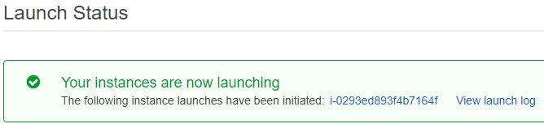
- Navigeer naar het EC2-menu.
- Maak een t2.micro Amazon Linux 2-machine met alle standaardinstellingen (de sleutel kan worden gedownload van het sandbox-lab)
- Maak een nieuw EBS-volume aan met de volgende vereisten:
  - Volumetype: SSD voor algemeen gebruik (gp2)
  - Maat: 1 GiB
  - Beschikbaarheidszone: hetzelfde als uw EC2
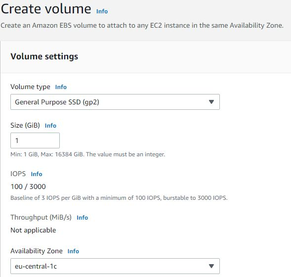
- Wacht tot de status beschikbaar is.
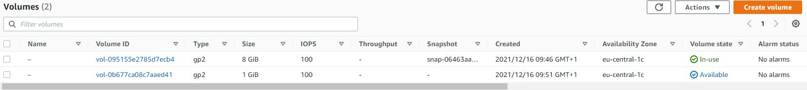

### Oefening 2
- Koppel uw nieuwe EBS-volume aan uw EC2-instantie.
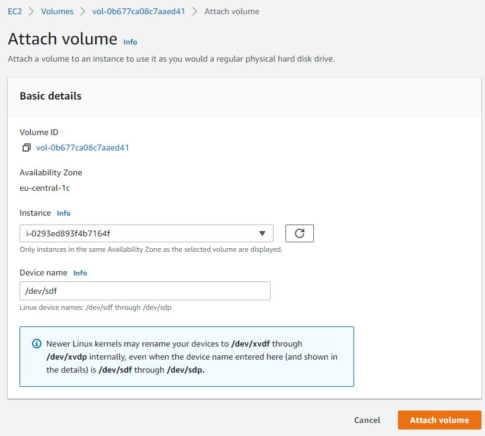

- Maak verbinding met uw EC2-instantie via SSH.

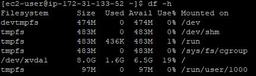

Hier bekijken we informatie over alle beschikbare blokapparaten.

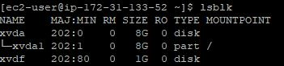

Indien het apparaat een bestandssysteem heeft, toont het commando informatie over het bestandssysteemtype. 

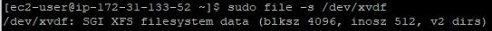

- Koppel het EBS-volume op uw instantie. 

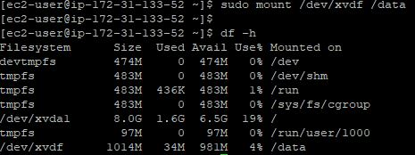

- Maak een tekstbestand en schrijf het naar het gekoppelde EBS-volume.

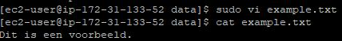

### Oefening 3

- Maak een momentopname van uw EBS-volume.

- Verwijder het tekstbestand van uw oorspronkelijke EBS-volume.

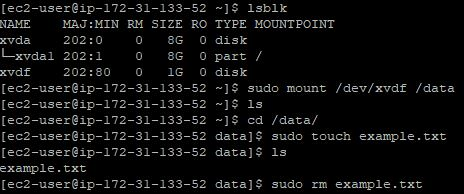

- Koppel uw originele EBS-volume los.

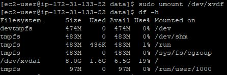

- Maak een nieuw volume met uw snapshot.

  Gedaan via de interface.

- Bevestig het nieuwe volume aan uw EC2 en koppel het.

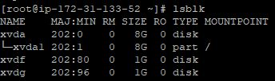

- Zoek uw tekstbestand op het nieuwe EBS-volume.

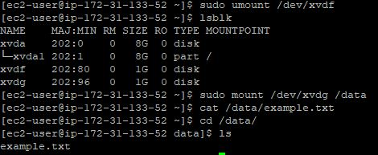

