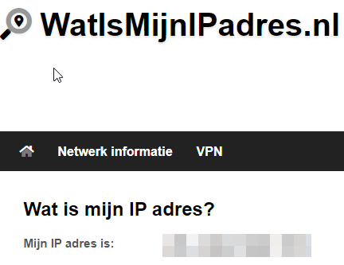
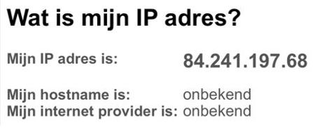
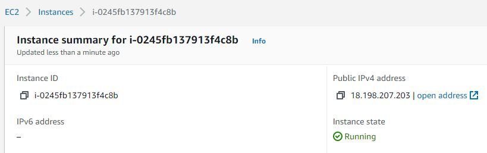
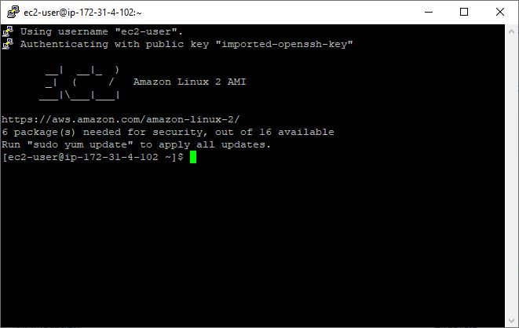
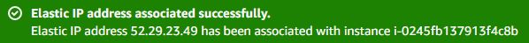

# IP adressen
Een IP-adres is een logisch adres dat aan een netwerkapparaat kan worden toegewezen. Met de 8 bytes in een IPv4-adres kunnen er 4.294.967.296 adressen zijn. Als u wilt weten wie uw openbare IP-adres wil, kunt u dit achterhalen met een whois-check.

## Key-terms

## Opdracht
- Ontdek wat je publieke IP adres is van je laptop en mobiel op wifi
- Ontdek wat je publieke IP adres is op je mobiel via mobiel internet (als mogelijk)
- Maak een VM in je cloud met een publiek IP. Maak verbinding met deze VM.
- Verwijder het publieke IP adres van je VM. Begrijp wat er gebeurt met je verbinding.

### Gebruikte bronnen

- [NAT Explained - Network Address Translation](https://www.youtube.com/watch?v=FTUV0t6JaDA)

### Ervaren problemen

### Resultaat

### Ontdek wat je publieke IP adres is van je laptop en mobiel op wifi

### Ontdek wat je publieke IP adres is op je mobiel via mobiel internet (als mogelijk)

#### Maak een VM in je cloud met een publiek IP.

#### Maak verbinding met deze VM.

#### Verwijder het publieke IP adres van je VM. Begrijp wat er gebeurt met je verbinding.

Door een nieuwe publiek ipv4 adres te associëren aan de ec2 instance, vervangt het de oude public ipv4 adres van 18.198.207.203 naar 52.29.23.49
en bestaat de oude ip adres technisch gezien niet meer (of niet meer in gebruik) dus de actieve verbinding die we hadden gemaakt met de vm word verbroken.