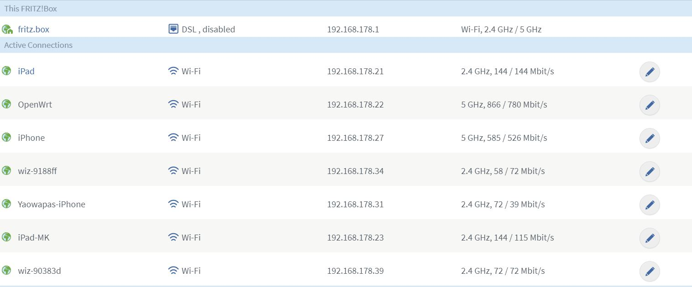
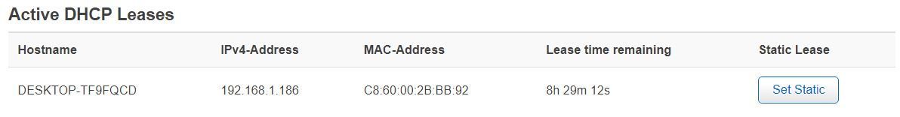
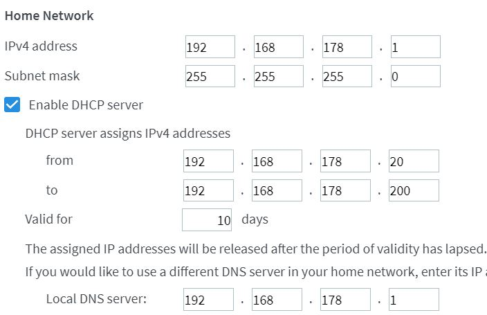
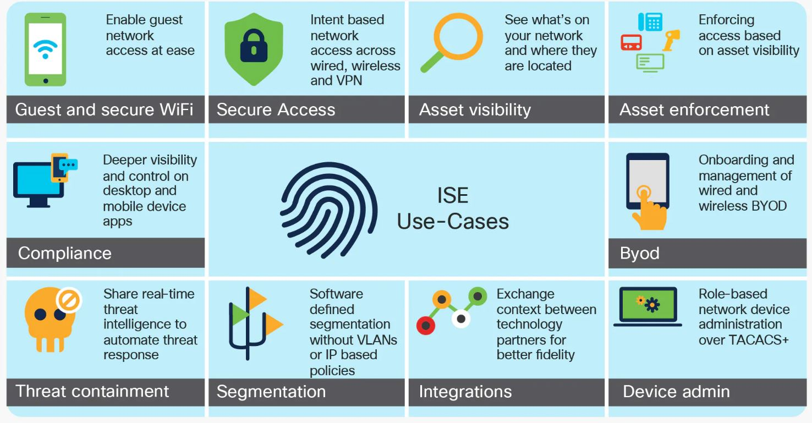

# Netwerkapparatuur

AWS and Azure offer services that are similar to what network appliances do. Every networking concept (routing, switching, gateways) has one or more cloud equivalents. Your network devices keep working even as you add or remove computers from your network. Protocols are important in this.
## Key-terms

- **DHCP** = Dynamisch Host Configuratie Protocol
- **MAC adres** = Media Access Control adres
- **WPA2** = Wi-Fi Protected Access 2
- **AES** = Geavanceerde Standaard Encryptie
- **TKIP** = Protocol voor tijdelijke sleutelintegriteit
- **WPS** = Wi-Fi Beschermde setup

## Opdracht
- Benoem en beschrijf de functies van veel voorkomend netwerkapparatuur
- Meeste routers hebben een overzicht van alle verbonden apparaten, vindt deze lijst. Welke andere informatie heeft de router over aangesloten apparatuur?
- De standaard instellingen
- Waar staat je DHCP server op jouw netwerk? Wat zijn de configuraties hiervan?
- Bekijk wat netwerkapparatuur voor bedrijven meer kunnen doen.

### Gebruikte bronnen

- [Network Devices Explained](https://blog.netwrix.com/2019/01/08/network-devices-explained/)
- [Computer Network Devices](https://www.youtube.com/watch?v=yYe6Mh9fig0)
- [What is enterprise networking?](https://www.vmware.com/topics/glossary/content/enterprise-networking.html)

### Ervaren problemen

### Resultaat

### Benoem en beschrijf de functies van veel voorkomend netwerkapparatuur

- **Hub**

    Een hub is een apparaat dat meerdere computernetwerkapparaten met elkaar verbindt. Een hub kan worden gebruikt voor zowel digitale als analoge gegevens, mits de instellingen zijn geconfigureerd. Hubs functioneren ook als repeater, in die zin dat zij signalen versterken die na het afleggen van lange afstanden slechter worden. **Hubs werken op de fysieke laag van het Open Systems Interconnection (OSI) model.**

- **switch**

    Een switch is een apparaat dat beperkte routeringsinformatie over knooppunten in het interne netwerk bijhoudt. **Een switch kan zowel op de datalinklaag als op de netwerklaag van het OSI-model werken.** Switches kunnen het doelwit zijn van DDoS-aanvallen (Distributed Denial of Service).    

- **Router**

    Routers banen zich een weg door de zee van onderling verbonden netwerkapparaten die verschillende netwerktopologieën gebruiken. Ze zijn de eerste verdedigingslinie en moeten worden geconfigureerd om alleen geautoriseerd verkeer door te laten. Routers kunnen ook intern worden verbonden met andere routers, waardoor zones ontstaan die onafhankelijk werken. Routers zijn apparaten voor algemeen gebruik die twee of meer heterogene netwerken met elkaar verbinden. Zij vormen de ruggengraat van grote computernetwerken zoals het internet. 
    **Routers werken op de netwerklaag van het OSI-model.** De routeringstabel bepaalt welke routes een pakket kan nemen van zijn bron naar zijn bestemming.
  

- **Bridge**

    Bridges worden gebruikt om twee of meer hosts of netwerksegmenten met elkaar te verbinden. Ze filteren inkomende gegevenspakketten, frames genoemd, op adressen voordat ze worden doorgestuurd. Bridges kunnen ook worden gebruikt om grotere netwerken in kleinere secties te verdelen door tussen twee fysieke netwerksegmenten te gaan zitten. **Bridges werken alleen op de fysieke en gegevensverbindingslagen van het OSI-model.**

- **Gateway**

    **Gateways werken gewoonlijk op de Transport- en Session-lagen van het OSI-model.** Op de Transportlaag en daarboven zijn er talrijke protocollen en standaarden van verschillende verkopers; gateways worden gebruikt om daarmee om te gaan. Gateways zorgen voor de vertaling tussen netwerktechnologieën zoals Open System Interconnection (OSI) en Transmission Control Protocol/Internet Protocol (TCP/IP). Hierdoor verbinden gateways twee of meer autonome netwerken, elk met zijn eigen routeringsalgoritmen, protocollen, topologie, domeinnaamdienst, en procedures en beleid voor netwerkbeheer.
    Gateways vervullen alle functies van routers en meer. In feite is een router met toegevoegde vertaalfunctionaliteit een gateway. De functie die de vertaling tussen verschillende netwerktechnologieën doet, wordt een protocolconverter genoemd.

  
- **Modem**

    Digitale signalen worden door de modem omgezet in analoge signalen van verschillende frequenties. De ontvangende modem voert de omgekeerde transformatie uit en levert een digitale uitgang. Digitale gegevens worden gewoonlijk van of naar een modem overgebracht via een seriële lijn met behulp van een RS-232 interface. Veel telefoonmaatschappijen bieden DSL-diensten aan, en veel kabelexploitanten gebruiken modems als eindapparatuur. **Modems werken zowel op de fysieke als op de datalink laag.**

- **Repeater**

    Een repeater is een elektronisch apparaat dat het ontvangen signaal versterkt. **Repeaters werken op de fysieke laag.**

- **Toegangspunt**

    Een toegangspunt (AP/Access Point) is een apparaat dat een bekabeld netwerk verbindt met een draadloos netwerk. **Een AP werkt op de tweede OSI laag, de gegevensverbindingslaag,** en kan werken als een brug die een standaard bekabeld netwerk verbindt met draadloze apparatuur of als een router die gegevenstransmissies doorgeeft van het ene toegangspunt naar het andere. Ze hebben ook meerdere poorten, zodat u extra clients kunt ondersteunen. Draadloze 802.11 netwerken gebruiken de SSID om alle systemen te identificeren die tot hetzelfde netwerk behoren. Toegangspunten kunnen controllergebaseerd of stand-alone zijn.
    Dikke AP's moeten handmatig worden geconfigureerd met netwerk- en beveiligingsinstellingen. Thin AP's maken configuratie op afstand met behulp van een controller mogelijk.

### Meeste routers hebben een overzicht van alle verbonden apparaten, vindt deze lijst. Welke andere informatie heeft de router over aangesloten apparatuur?

- Namen van devices dat verbonden zijn. _(host name)_
- wifi frequentie _(2.4 Ghz of 5 Ghz)_.
- private ipv4-address
- actuele snelheid verbinding.

- naam van toestel _(host name)_
- private ipv4-address
- MAC-Adres
- resterende leasetijd
- Of het een statische lease is of niet.

### De standaard instellingen

- Firewall dat aan staat
- Wifi aan zowel 2.4/5 Ghz
- WPA2 tkip/aes mixed encryption _(of alleen aes)_
- WPS _(Wi-Fi Protected Setup)_ staat aan.

### Waar staat je DHCP server op jouw netwerk? 

In de meterkast.

### Wat zijn de configuraties hiervan?

### Bekijk wat netwerkapparatuur voor bedrijven meer kunnen doen.

Modern bedrijfsnetwerkapparatuur bestaat uit een gemeenschappelijk netwerk en beveiligingsplatforms dat een variatie aan netwerkdiensten biedt, zoals switching, routing, load balancing, firewalling, wifi, en service mesh voor moderne toepassingen.

