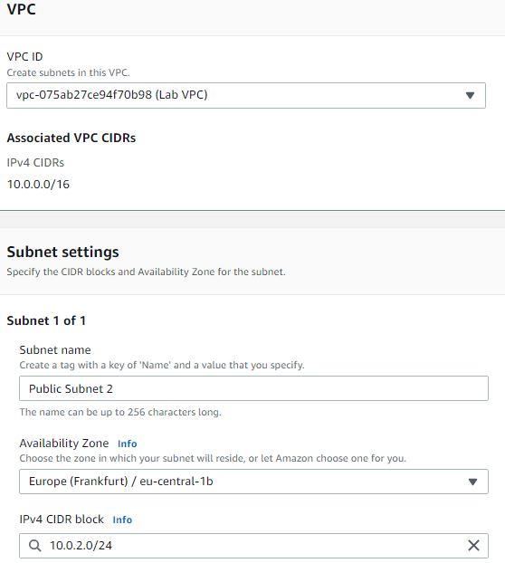
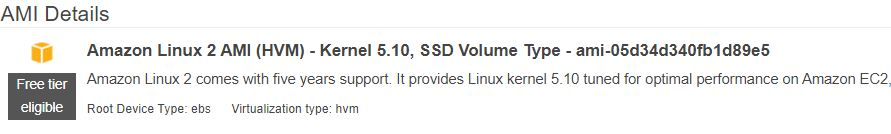
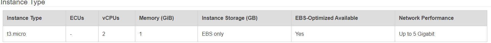

# Virtuele privécloud (VPC)
De Amazon VPC is een virtueel privé datacenter in de cloud. U kunt subnets, internet gateways (igw), NAT gateways, VPN-verbindingen en meer aanmaken. VPC's werken op regionaal niveau, terwijl subnetten alleen in één beschikbaarheidszone kunnen worden geplaatst.
## Key-terms

## Opdracht

### Oefening 1:
- Navigeer naar het VPC menu in uw sandbox omgeving.
- Wijs een Elastic IP-adres toe aan uw account.
  - Gebruik de optie Launch VPC Wizard om een nieuwe VPC aan te maken met de volgende vereisten:
  - Regio: Frankfurt (eu-central-1)
  - VPC met een publiek en een privaat subnet
  - Naam: Lab VPC
  - CIDR: 10.0.0.0/16
- Vereisten voor het publieke subnet:
  - Naam: Publiek subnet 1
  - CIDR: 10.0.0.0/24
  - AZ: eu-central-1a
- Eisen aan het private subnet:
  - Naam: Particulier subnet 1
  - CIDR: 10.0.1.0/24
  - AZ: eu-central-1a
  
### Oefening 2:
- Maak een extra publiek subnet met de volgende vereisten:
  - VPC: Lab VPC
  - Naam: Openbaar Subnet 2
  - AZ: eu-central-1b
  - CIDR: 10.0.2.0/24
- Maak een extra privésubnet met de volgende vereisten:
  - VPC: Lab VPC
  - Naam: Privésubnet 2
  - AZ: eu-central-1b
  - CIDR: 10.0.3.0/24
- Bekijk de hoofdroutetabel voor Lab VPC. Deze zou een entry moeten hebben voor de NAT gateway. Hernoem deze route tabel naar Private Route Table.
- Koppel de private route tabel expliciet aan uw twee private subnetten.
- Bekijk de andere route tabel voor Lab VPC. Deze zou een entry moeten hebben voor de internet gateway. Hernoem deze route tabel naar Public Route Table.
- Koppel de publieke route tabel expliciet aan uw twee publieke subnetten.

### Oefening 3:
- Maak een Beveiligingsgroep met de volgende vereisten:
  - Naam: Web SG
  - Beschrijving: HTTP-toegang mogelijk maken
  - VPC: Lab VPC
  - Inkomende regel: HTTP toegang overal vandaan toestaan
  - Uitgaande regel: Sta alle verkeer toe

### Oefening 4:
- Start een EC2 instance met de volgende vereisten:
   - AMI: Amazon Linux 2
   - Type: t3.micro
   - Subnet: Openbaar subnet 2
   - Auto-toewijzen publiek IP: Inschakelen
   - Gebruikersgegevens:

            #!/bin/bash
            yum install -y httpd mysql php
            wget https://aws-tc-largeobjects.s3.amazonaws.com/CUR-TF-100-RESTRT-1/80-lab-vpc-web-server/lab-app.zip
            unzip lab-app.zip -d /var/www/html/
            chkconfig httpd on
            service httpd start

   - Tag:

      Key: Naam:

      Waarde: Webserver

   - Beveiligingsgroep: Web SG
   - Sleutelpaar: geen sleutelpaar
- Maak verbinding met uw server met de openbare IPv4 DNS naam.

### Gebruikte bronnen

### Ervaren problemen
Webpagina moest ik van `https` veranderen naar `http`.

### Resultaat

### Oefening 1:
- Navigeer naar het VPC menu in uw sandbox omgeving.

- Wijs een Elastic IP-adres toe aan uw account.

  - Gebruik de optie Launch VPC Wizard om een nieuwe VPC aan te maken met de volgende vereisten:

  - Regio: Frankfurt (eu-central-1)
  - VPC met een publiek en een privaat subnet
  - Naam: Lab VPC
  - CIDR: 10.0.0.0/16
  - Vereisten voor het publieke subnet:
    - Naam: Publiek subnet 1
    - CIDR: 10.0.0.0/24
    - AZ: eu-central-1a
  - Eisen aan het private subnet:
    - Naam: Particulier subnet 1
    - CIDR: 10.0.1.0/24
    - AZ: eu-central-1a

### Oefening 2:
- Maak een extra publiek subnet met de volgende vereisten:
  - VPC: Lab VPC
  - Naam: Openbaar Subnet 2
  - AZ: eu-central-1b
  - CIDR: 10.0.2.0/24

- Maak een extra privésubnet met de volgende vereisten:
  - VPC: Lab VPC
  - Naam: Privésubnet 2
  - AZ: eu-central-1b
  - CIDR: 10.0.3.0/24

- Bekijk de hoofdroutetabel voor Lab VPC. Deze zou een entry moeten hebben voor de NAT gateway. Hernoem deze route tabel naar Private Route Table.

- Koppel de private route tabel expliciet aan uw twee private subnetten.

- Bekijk de andere route tabel voor Lab VPC. Deze zou een entry moeten hebben voor de internet gateway. Hernoem deze route tabel naar Public Route Table.

- Koppel de publieke route tabel expliciet aan uw twee publieke subnetten.

### Oefening 3:
- Maak een Beveiligingsgroep met de volgende vereisten:
  - Naam: Web SG
  - Beschrijving: HTTP-toegang mogelijk maken
  - VPC: Lab VPC
  - Inkomende regel: HTTP toegang overal vandaan toestaan
  - Uitgaande regel: Sta alle verkeer toe

### Oefening 4:
- Start een EC2 instance met de volgende vereisten:
   - AMI: Amazon Linux 2
  

  - Type: t3.micro

  - Subnet: Openbaar subnet 2
  - Auto-toewijzen publiek IP: Inschakelen
  - Gebruikersgegevens:

           #!/bin/bash
           yum install -y httpd mysql php
           wget https://aws-tc-largeobjects.s3.amazonaws.com/CUR-TF-100-RESTRT-1/80-lab-vpc-web-server/lab-app.zip
           unzip lab-app.zip -d /var/www/html/
           chkconfig httpd on
           service httpd start

   - Tag:

      Key: Naam:

      Waarde: Webserver

   - Beveiligingsgroep: Web SG

   - Sleutelpaar: geen sleutelpaar

   - Maak verbinding met uw server met de openbare IPv4 DNS naam.

