# Elastisch laden balanceren (ELB) & automatisch schalen
Met AWS' Auto Scaling kunt u een vloot van EC2-instanties hosten in plaats van een enkele server. Wanneer de vraag naar de applicatie hoog is, kunnen automatisch instances aan de vloot worden toegevoegd. De load balancer zal het verzoek doorsturen naar een van de servers, en het antwoord terugsturen naar de client.

## Key-terms

## Opdracht
### Oefening 1:
- Start een EC2 instance met de volgende vereisten:
  - Regio: Frankfurt (eu-centraal-1)
  - AMI: Amazon Linux 2
  - Type: t3.micro
  - Gebruikersgegevens:
  
         #!/bin/bash
         yum install -y httpd mysql php
         wget https://aws-tc-largeobjects.s3.amazonaws.com/CUR-TF-100-RESTRT-1/80-lab-vpc-web-server/lab-app.zip
         unzip lab-app.zip -d /var/www/html/
         chkconfig httpd on
         service httpd start
  - Beveiligingsgroep: Sta HTTP toe
- Wacht tot de statuscontroles geslaagd zijn.
- Maak een AMI van uw instantie met de volgende vereisten:
  - Naam image: Webserver AMI

### Oefening 2:
- Maak een applicatie load balancer met de volgende vereisten:
  - Naam: LabELB
  - Listener: HTTP op poort 80
  - AZs: eu-central-1a en eu-central-1b
  - Subnetten: moeten openbaar zijn
- Beveiligingsgroep: 
  - Naam: ELB SG
  - Regels: HTTP-toegang toestaan
- Doelgroep:
  - Naam: LabTargetGroup
  - Targets: te registreren door Auto Scaling

### Oefening 3:
- Maak een launch configuratie voor de Auto Scaling groep. Deze moet identiek zijn aan de server die momenteel draait.
- Maak een auto scaling groep aan met de volgende vereisten:
  - Naam: Lab ASG
  - Start Configuratie: Web server launch configuratie
  - Subnetten: moeten in eu-central-1a en eu-central-1b zijn
  - Load Balancer: LabELB
  - Groepsmetriekverzameling in CloudWatch moet ingeschakeld zijn
  - Groepsgrootte:
    - Gewenste capaciteit: 2
    - Minimale Capaciteit: 2
    - Maximale capaciteit: 4
  - Schalingsbeleid: Doelvolgen met een streefcijfer van 60% gemiddeld CPU-gebruik

### Oefening 4:
- Controleer of de EC2 instances online zijn en of ze deel uitmaken van de doelgroep voor de loadbalancer.
- Open de server via de ELB door de DNS naam van de ELB te gebruiken.
- Voer een loadtest uit op uw server(s) met behulp van de website op uw server om auto scaling te activeren. Er kan een vertraging optreden bij het aanmaken van nieuwe servers in uw vloot, afhankelijk van de instellingen op uw Auto Scaling Group.

### Gebruikte bronnen

- [AWS Autoscaling | AWS Autoscaling And Load Balancing | AWS Tutorial For Beginners | Simplilearn](https://www.youtube.com/watch?v=4EOaAkY4pNE)

### Ervaren problemen

### Resultaat

### Oefening 1:
- Start een EC2 instance met de volgende vereisten:
  - Regio: Frankfurt (eu-centraal-1)
  - AMI: Amazon Linux 2

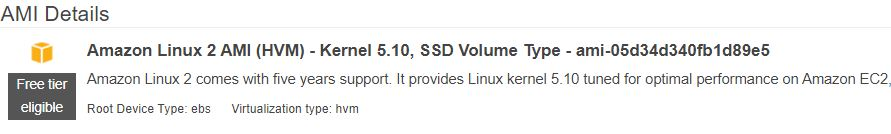
  - Type: t3.micro

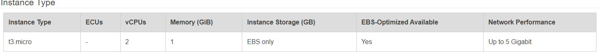
  - Gebruikersgegevens:
  
         #!/bin/bash
         yum install -y httpd mysql php
         wget https://aws-tc-largeobjects.s3.amazonaws.com/CUR-TF-100-RESTRT-1/80-lab-vpc-web-server/lab-app.zip
         unzip lab-app.zip -d /var/www/html/
         chkconfig httpd on
         service httpd start

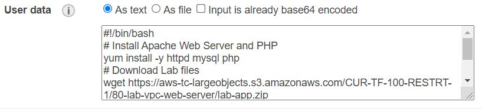
  - Beveiligingsgroep: Sta HTTP toe

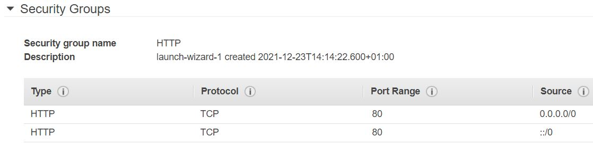
  - Wacht tot de statuscontroles geslaagd zijn.

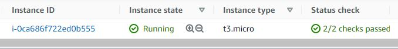
  - Maak een AMI van uw instantie met de volgende vereisten:
    - Naam image: Webserver AMI

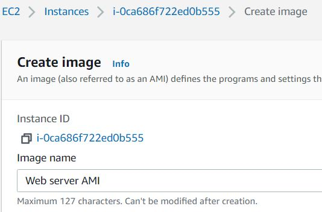

### Oefening 2:
- Maak een applicatie load balancer met de volgende vereisten:
  - Naam: LabELB
  - Listener: HTTP op poort 80
  - AZs: eu-central-1a en eu-central-1b
  - Subnetten: moeten openbaar zijn
- Beveiligingsgroep: 
  - Naam: ELB SG
  - Regels: HTTP-toegang toestaan

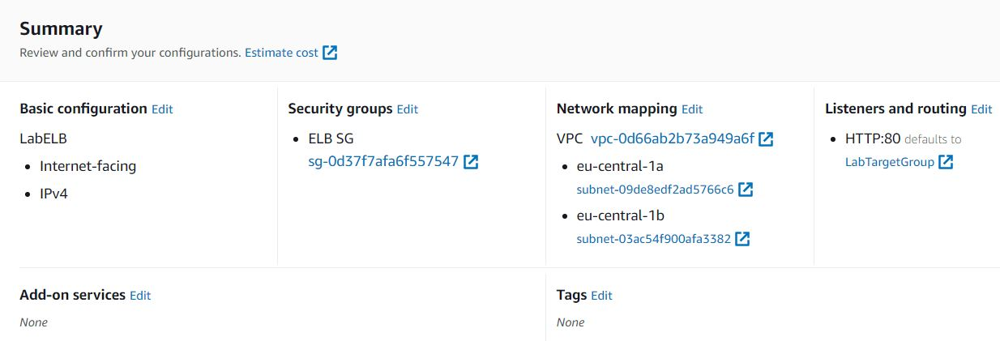

- Doelgroep:
  - Naam: LabTargetGroup
  - Targets: te registreren door Auto Scaling

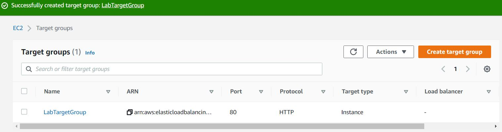

### Oefening 3:
- Maak een launch configuratie voor de Auto Scaling groep. Deze moet identiek zijn aan de server die momenteel draait.
- Maak een auto scaling groep aan met de volgende vereisten:
  - Naam: Lab ASG

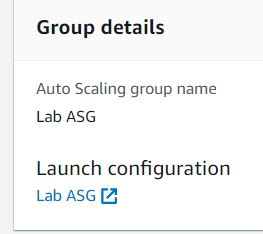

  - Start Configuratie: Web server launch configuratie
  - Subnetten: moeten in eu-central-1a en eu-central-1b zijn

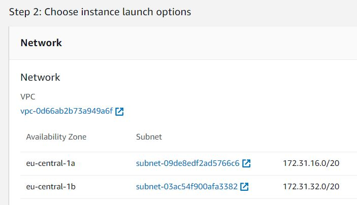
  - Load Balancer: LabELB

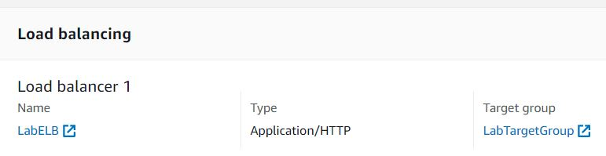
  - Groepsmetriekverzameling in CloudWatch moet ingeschakeld zijn

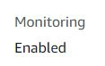
  - Groepsgrootte:
    - Gewenste capaciteit: 2
    - Minimale Capaciteit: 2
    - Maximale capaciteit: 4
  - Schalingsbeleid: Doelvolgen met een streefcijfer van 60% gemiddeld CPU-gebruik

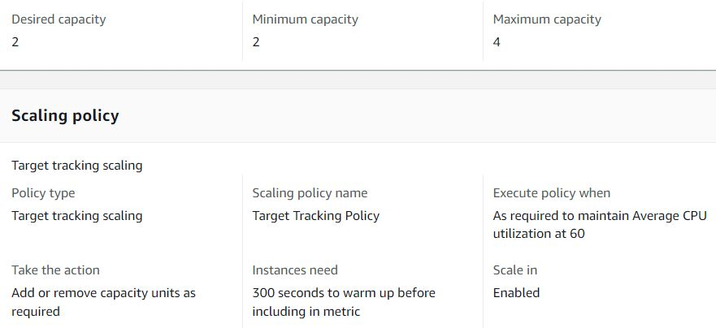

### Oefening 4:
- Controleer of de EC2 instances online zijn en of ze deel uitmaken van de doelgroep voor de loadbalancer.

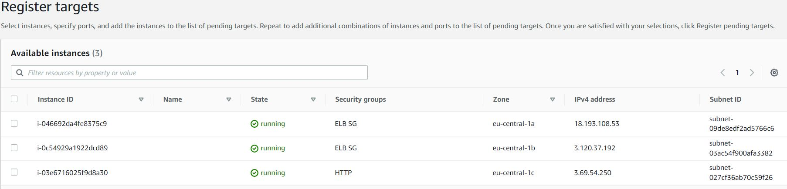
- Open de server via de ELB door de DNS naam van de ELB te gebruiken.

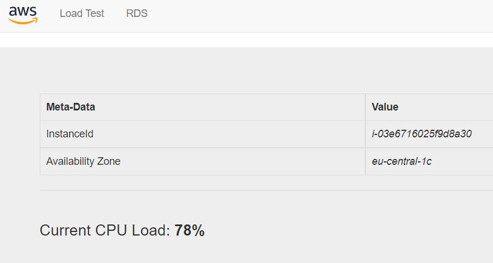
- Voer een loadtest uit op uw server(s) met behulp van de website op uw server om auto scaling te activeren. Er kan een vertraging optreden bij het aanmaken van nieuwe servers in uw vloot, afhankelijk van de instellingen op uw Auto Scaling Group.

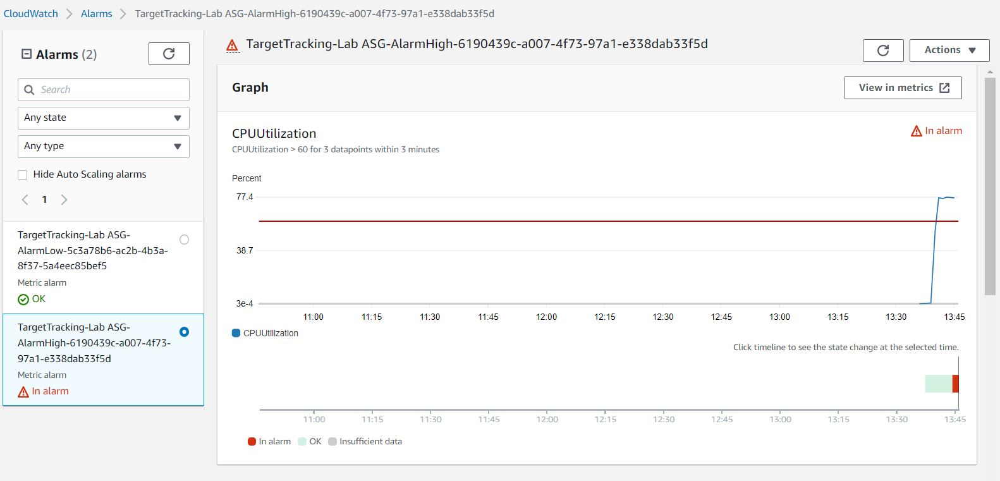

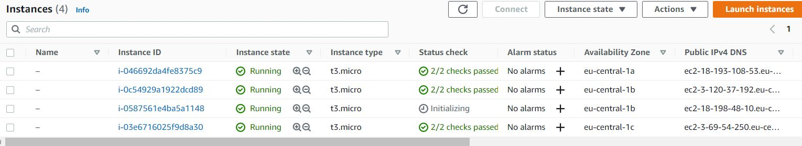
