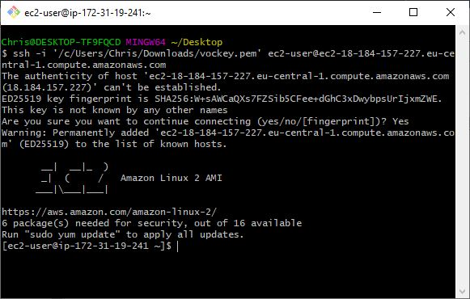

# Elastic File System
Amazon EFS is een set-and-forget, serverless, elastisch bestandssysteem dat het eenvoudig maakt om bestandsopslag op te zetten, te schalen en te optimaliseren op de AWS Cloud. Met een paar klikken in de AWS Management Console kunt u bestandssystemen maken die toegankelijk zijn via een bestandssysteeminterface (met behulp van standaard besturingssysteem file I/O API's) voor Amazon EC2-instanties, Amazon-containerservices (Amazon Elastic Container Service (ECS), Amazon Elastic Kubernetes Service (EKS) en AWS Lambda-functies, en volledige bestandssysteemtoegangssemantiek ondersteunen (zoals sterke consistentie en bestandsvergrendeling).
Zonder de noodzaak om opslag toe te wijzen, kunnen Amazon EFS-bestandssystemen automatisch schalen van gigabytes tot petabytes aan gegevens. Een Amazon EFS bestand kan worden benaderd door tientallen, honderden of zelfs duizenden computerinstanties.
## Key-terms

## Opdracht

In deze Oefening leert u hoe u Amazon EFS kunt gebruiken om uw bestanden in de cloud op te slaan.
- Het maken van een Amazon EFS-bestandssysteem, 
- Het gebruiken van een Amazon EC2 om een Linux virtuele machine te starten, 
- Leren koppelen van systemen, maken van een bestand, 
- beëindigen van instances en vernietigen van bestandssystemen.

### Gebruikte bronnen
- [Amazon EFS FAQs](https://aws.amazon.com/efs/faq/)
- [Create a Network File System](https://aws.amazon.com/getting-started/tutorials/create-network-file-system/)
### Ervaren problemen
- Lab is verouderd.
- firewall regels voor security group moest ik handmatig aanwijzen.

### Resultaat

#### Oefening 1: Creëer een bestandssysteem

#### Oefening 2: Creëer en configureer een virtuele machine met Amazon EC2

#### Oefening 3: Maak verbinding met uw instance

#### Oefening 4: Mount uw bestandssysteem

#### Oefening 5: Termineer uw resources

