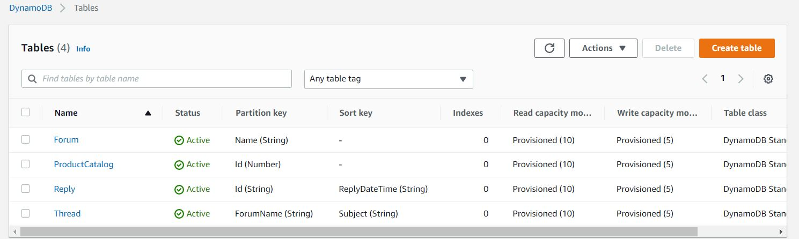

# DynamoDB
Amazon DynamoDB is een volledig beheerde NoSQL database service met naadloze schaalbaarheid en snelle en voorspelbare prestaties. U hoeft zich geen zorgen te maken over hardware provisioning, setup en configuratie, replicatie, software patching, of cluster schaalbaarheid met DynamoDB omdat het de administratieve vereisten van het runnen en beheren van een gedistribueerde database uit handen neemt. DynamoDB ondersteunt ook encryptie in ruste, wat de tijd en moeite vermindert die nodig is om gevoelige data te beveiligen.


Je kunt database tabellen ontwerpen met DynamoDB die elke hoeveelheid data kunnen opslaan en ophalen en elke hoeveelheid request verkeer kunnen verwerken. Je kan de doorvoer capaciteit van je tabellen verhogen of verlagen zonder downtime of performance vermindering. De AWS Management Console kan gebruikt worden om alles bij te houden.

## Key-terms

- **Backup vault** = een container waarin u uw back-ups organiseert.
- **Backup plan** = een beleidsexpressie die definieert wanneer en hoe u een back-up wilt maken van uw AWS-bronnen. Het back-upplan is gekoppeld aan een back-upkluis.
- **Resource assignment** = definieert van welke resources een back-up moet worden gemaakt. U kunt resources selecteren op basis van tags of op basis van resource ARN.
- **Recovery point** = een momentopname/back-up van een resource waarvan een back-up is gemaakt door AWS Backup. Elk herstelpunt kan worden hersteld met AWS Backup.


## Opdracht

- Oefening 1: Maak de DynamoDB tabellen aan.
- Oefening 2: Laad voorbeeld Data
- Oefening 3: Verken de DynamoDB tabellen data.
- 
### Gebruikte bronnen

- [Hands-on labs for Amazon DynamoDB](https://amazon-dynamodb-labs.com/hands-on-labs.html)
- [What Is Amazon DynamoDB?](https://docs.aws.amazon.com/amazondynamodb/latest/developerguide/Introduction.html)

### Ervaren problemen

### Resultaat

### Oefening 1: Maak de DynamoDB tabellen aan.

    aws dynamodb create-table \
    --table-name ProductCatalog \
    --attribute-definitions \
        AttributeName=Id,AttributeType=N \
    --key-schema \
        AttributeName=Id,KeyType=HASH \
    --provisioned-throughput \
        ReadCapacityUnits=10,WriteCapacityUnits=5

    aws dynamodb create-table \
    --table-name Forum \
    --attribute-definitions \
        AttributeName=Name,AttributeType=S \
    --key-schema \
        AttributeName=Name,KeyType=HASH \
    --provisioned-throughput \
        ReadCapacityUnits=10,WriteCapacityUnits=5

    aws dynamodb create-table \
    --table-name Thread \
    --attribute-definitions \
        AttributeName=ForumName,AttributeType=S \
        AttributeName=Subject,AttributeType=S \
    --key-schema \
        AttributeName=ForumName,KeyType=HASH \
        AttributeName=Subject,KeyType=RANGE \
    --provisioned-throughput \
        ReadCapacityUnits=10,WriteCapacityUnits=5

    aws dynamodb create-table \
    --table-name Reply \
    --attribute-definitions \
        AttributeName=Id,AttributeType=S \
        AttributeName=ReplyDateTime,AttributeType=S \
    --key-schema \
        AttributeName=Id,KeyType=HASH \
        AttributeName=ReplyDateTime,KeyType=RANGE \
    --provisioned-throughput \
        ReadCapacityUnits=10,WriteCapacityUnits=5

    aws dynamodb wait table-exists --table-name ProductCatalog && \
    aws dynamodb wait table-exists --table-name Reply && \
    aws dynamodb wait table-exists --table-name Forum && \
    aws dynamodb wait table-exists --table-name Thread

### Oefening 2: Laad voorbeeld Data

Eerst download ik de voorbeeld Data


Daarna laad ik de data met ```batch-write-item``` commando.


### Oefening 3: Verken de DynamoDB tabellen data.


