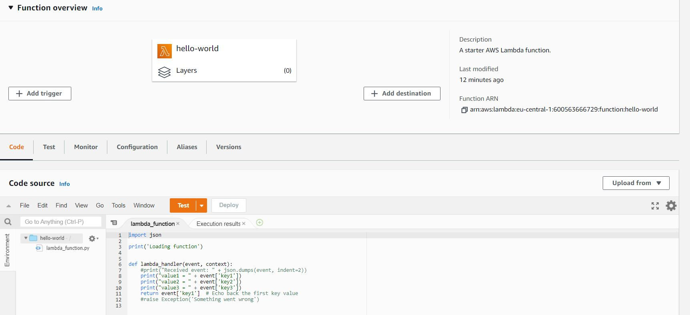
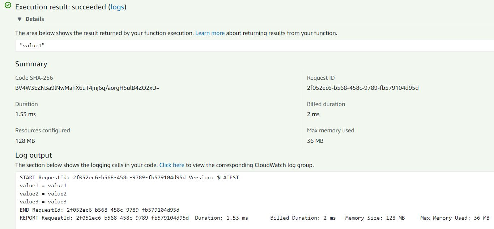

# Lambda
Met AWS Lambda kunt u code uitvoeren zonder dat u servers hoeft te provisioneren of te beheren. U betaalt alleen voor de computertijd die u gebruikt; wanneer uw code niet draait, is er geen prijs. Met Lambda kunt u code draaien voor bijna elke vorm van applicatie of backend service, en u hoeft zich geen zorgen te maken over het beheer. U hoeft alleen maar uw code te uploaden en Lambda regelt alles wat nodig is om deze te draaien en te laten groeien met hoge beschikbaarheid. U kunt uw code zo instellen dat deze automatisch door andere AWS-services wordt geactiveerd, of u kunt de code rechtstreeks vanuit een web- of mobiele app aanroepen.

## Key-terms

## Opdracht

- Oefening 1: Maak een Lambda blueprint functie.
- Oefening 2: Test de code.

### Gebruikte bronnen

- [AWS Lambda Tutorial](https://www.youtube.com/watch?v=seaBeltaKhw)
- [AWS Lambda FAQs](https://aws.amazon.com/lambda/faqs/)

### Ervaren problemen

### Resultaat

### Oefening 1: Maak een Lambda blueprint functie.

### Oefening 2: Test de code.

