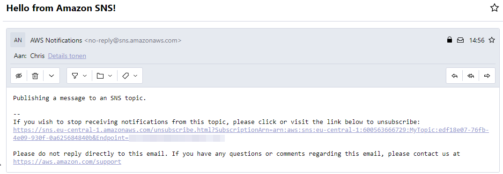

# Simple Notification Service
Amazon SNS (Amazon Simple Notification Service) is een beheerde dienst die berichten levert van uitgevers aan abonnees (ook bekend als producenten en consumenten). Uitgevers communiceren asynchroon met abonnees door berichten naar een topic te sturen, dat dient als logisch toegangspunt en communicatieroute voor abonnees. Cliënten kunnen zich abonneren op het SNS-onderwerp en gepubliceerde berichten ontvangen via elk ondersteund eindpunt, waaronder Amazon Kinesis Data Firehose, Amazon SQS, AWS Lambda, HTTP, e-mail, mobiele pushmeldingen en mobiele tekstberichten (SMS).
## Key-terms

**SNS** = Simple Notification Service
## Opdracht

Deze oefening helpt u meer vertrouwd te raken met Amazon SNS door u te laten zien hoe u onderwerpen, abonnementen en berichten kunt beheren met behulp van de Amazon SNS-console.

### Gebruikte bronnen
- [Getting started with Amazon SNS](https://docs.aws.amazon.com/sns/latest/dg/sns-getting-started.html#step-create-queue)

### Ervaren problemen

### Resultaat

#### Oefening 1: Maak een onderwerp aan

#### Oefening 2: Maak een abonnement aan op het onderwerp

#### Oefening 3: Publiceer een bericht in het onderwerp

#### Oefening 4: Verwijder het abonnement en het onderwerp

