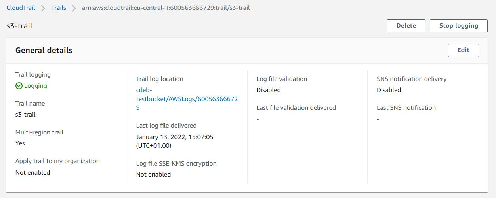
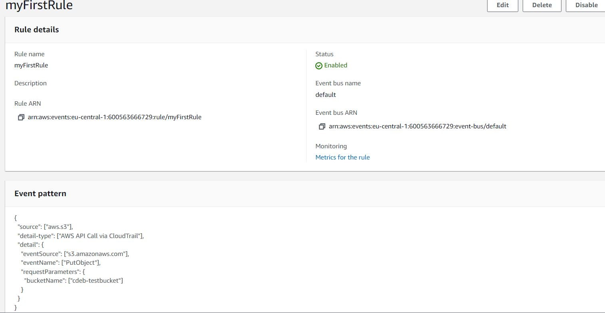
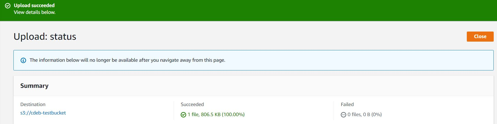
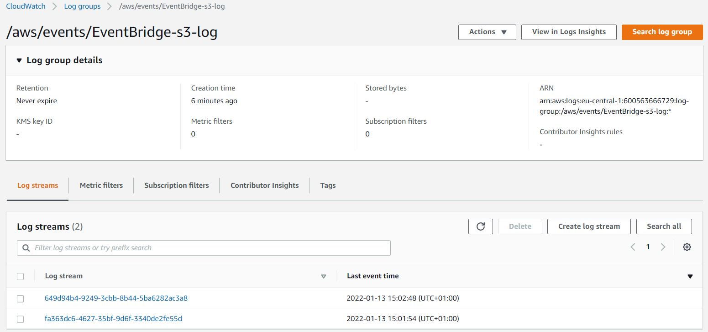

# Event Bridge
Zonder code te hoeven schrijven, geeft Amazon EventBridge real-time toegang tot gegevenswijzigingen in AWS services, uw eigen applicaties en software as a service (SaaS) applicaties. Om aan de slag te gaan, gaat u naar de Amazon EventBridge console en kiest u een event source en vervolgens een target uit een lijst van AWS services zoals AWS Lambda, Amazon SNS, en Amazon Kinesis Data Firehose. De events zullen in near-real-time worden afgeleverd via Amazon EventBridge.

## Key-terms

## Opdracht

- Oefening 1: Maak een regel aan in aws EventBridge.
- Oefening 2: Test of het werkt.

### Gebruikte bronnen
- [Amazon EventBridge FAQs](https://aws.amazon.com/eventbridge/faqs/)
- [Intro to Amazon EventBridge](https://youtu.be/TXh5oU_yo9M)
- [How To Get Started With Amazon EventBridge](https://www.youtube.com/watch?v=ea9SCYDJIm4)
### Ervaren problemen

Je moest blijkbaar eerst een CloudTrail aanmaken voor je bucket.

### Resultaat

### Oefening 1: Maak een regel aan in aws EventBridge.

### Oefening 2: Test of het werkt.

Om het te testen upload ik eerst een bestand.

CloudWatch log:

