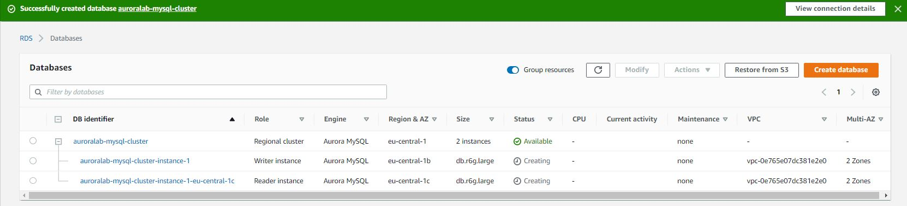
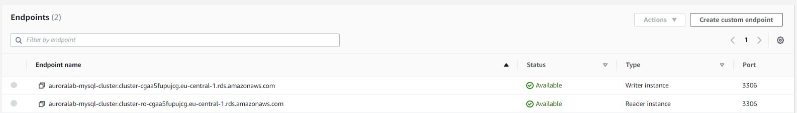
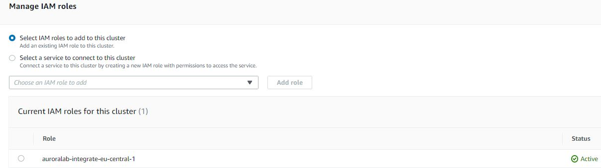
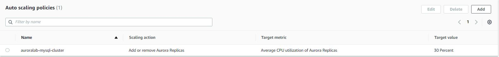
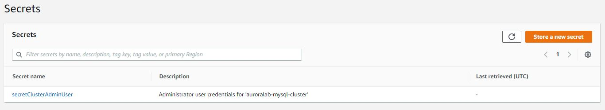
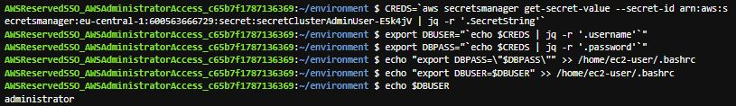
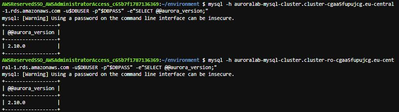
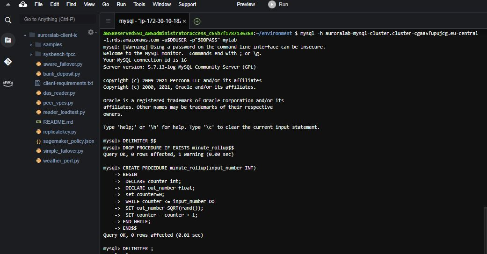
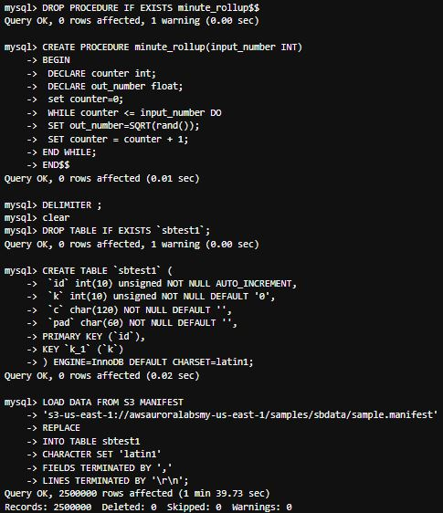

# Relational Database Service (Aurora)
Amazon RDS (Amazon Relational Database Service) is een webservice waarmee u eenvoudig een relationele database kunt opzetten, beheren en schalen in de Amazon Web Services Cloud. Het voert elementaire database-administratietaken uit en biedt tegelijkertijd kosteneffectieve, schaalbare capaciteit voor een relationele database volgens de industriestandaard.

Aurora (Amazon Aurora) is een volledig beheerde relationele database engine die MySQL en PostgreSQL ondersteunt. MySQL en PostgreSQL combineren de snelheid en betrouwbaarheid van high-end commerciële databases met de eenvoud en kosteneffectiviteit van open-source databases, zoals je al weet. U kunt Aurora gebruiken met dezelfde code, tools, en apps die u gebruikt met uw bestaande MySQL en PostgreSQL databases. Zonder dat er veranderingen nodig zijn aan de meeste van uw bestaande toepassingen, kan Aurora tot vijf keer de doorvoer van MySQL geven en tot drie keer de doorvoer van PostgreSQL in specifieke workloads.

Aurora wordt geleverd met een opslag subsysteem met hoge capaciteit. De MySQL en PostgreSQL database engines zijn aangepast om voordeel te halen uit de snelheid van de gedistribueerde opslag. Indien nodig, breidt de onderliggende opslag automatisch uit. Het volume van een Aurora cluster.
## Key-terms

- **RDS = Relational Database Service**

## Opdracht

In de eerste lab zal ik een Amazon Aurora database cluster aanmaken, en het configureren van de parameters die nodig zijn voor de cluster componenten.

In de tweede lab zal ik verbinding maken met de DB cluster en initiële gegevensverzameling van S3 laden.
### Gebruikte bronnen

- [Create a New Aurora Cluster](https://awsauroralabsmy.com/provisioned/create/)
- [What is Amazon Aurora?](https://docs.aws.amazon.com/AmazonRDS/latest/AuroraUserGuide/CHAP_AuroraOverview.html)
- [What is Amazon Relational Database Service (Amazon RDS)?](https://docs.aws.amazon.com/AmazonRDS/latest/UserGuide/Welcome.html)
- [Introduction to Amazon Aurora - Relational Database Built for the Cloud - AWS](https://www.youtube.com/watch?v=FzxqIdIZ9wc)
- [Amazon Aurora Global Database Deep Dive](https://youtu.be/1vFg1z-2E7Y)

### Ervaren problemen

### Resultaat

### Oefening 1: Creëer het DB-cluster

### Oefening 2: De DB-cluster eindpunten ophalen

### Oefening 3: Wijs een IAM rol toe aan het DB cluster

### Oefening 4: Maak een replica auto scaling beleid

### Oefening 5: Creëer een AWS Secrets Manager geheim

### Oefening 6: Configureer uw Cloud9 desktop

### Oefening 7: Verifieer DB-cluster

### Oefening 8: Verbinden met de DB cluster

### Oefening 9: Laad een initiële gegevensverzameling van S3

