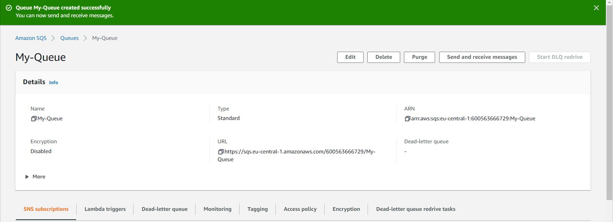
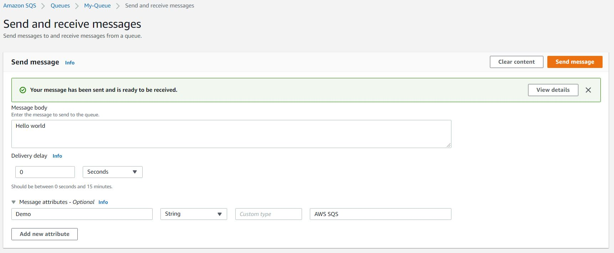
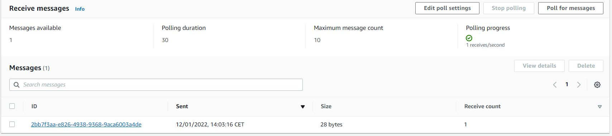
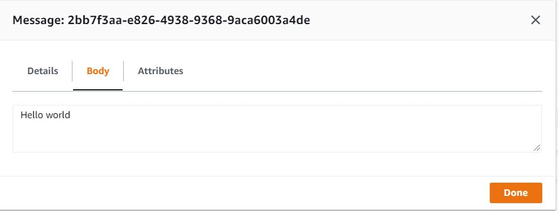

# Simple Queue Service
SQS (Amazon Simple Queue Service) is een volledig beheerde message queuing service voor het ontkoppelen en schalen van microservices, gedistribueerde systemen en serverloze applicaties. SQS neemt de complexiteit en overhead weg van het beheren en bedienen van bericht-georiënteerde middleware, waardoor ontwikkelaars zich kunnen concentreren op werk dat uniek is. U kunt berichten verzenden, opslaan en ontvangen over softwarecomponenten met behulp van SQS op elk volume zonder berichten te verliezen of de beschikbaarheid van andere services nodig te maken. Met behulp van de AWS-terminal, de Command Line Interface of SDK van uw voorkeur en drie eenvoudige commando's kunt u in enkele minuten aan de slag met SQS.

SQS biedt twee verschillende soorten wachtrijen voor berichten. Standaard wachtrijen bieden een hoge doorvoer, best-effort ordening, en levering ten minste eenmaal. SQS FIFO wachtrijen zijn bedoeld om ervoor te zorgen dat berichten slechts eenmaal verwerkt worden.
## Key-terms

- **SQS** = Simple Queue Service

## Opdracht
- Oefening 1: Maak een SQS bericht.
- Oefening 2: Stuur een bericht.
- Oefening 3: De bericht ontvangen.
- Oefening 4: Lees de bericht.

### Gebruikte bronnen

- [What is Amazon Simple Queue Service?](https://docs.aws.amazon.com/AWSSimpleQueueService/latest/SQSDeveloperGuide/welcome.html)
- [AWS SQS | AWS Simple Queue Service](https://www.youtube.com/watch?v=vLNDaZuA3Dc)

### Ervaren problemen

### Resultaat

### Oefening 1: Maak een SQS bericht.

### Oefening 2: Stuur een bericht.

### Oefening 3: De bericht ontvangen.

### Oefening 4: Lees de bericht.

