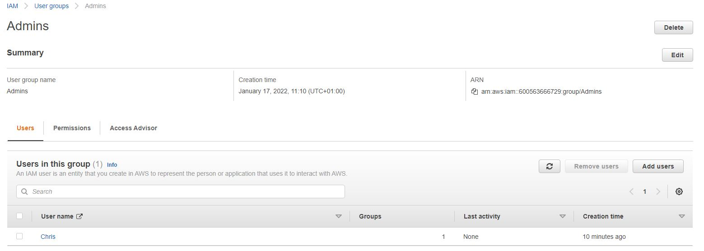
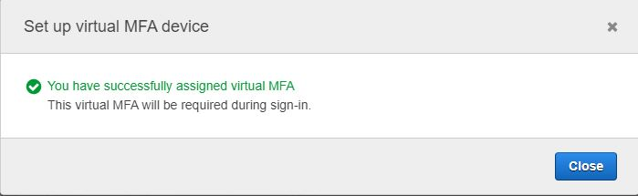
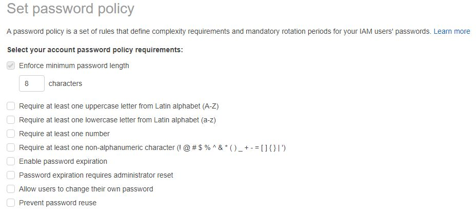

# Identity and Access Management
Individuele en groepstoegang tot uw AWS resources kan veilig worden beheerd met IAM. U kunt gebruikers-ID's aanmaken en onderhouden (ook bekend als "IAM-gebruikers"), en hen autorisatie verlenen voor toegang tot uw bronnen. Buiten AWS, kunt u ook rechten toekennen aan gebruikers (federatieve gebruikers).

## Key-terms

- **IAM** = Identity and Access Management
- **MFA** = Multi-factor authentication

## Opdracht

- Oefening 1: individuele Account gebruiker instellen.
- Oefening 2: Multi-Factor Authenticatie (MFA) instellen.
- Oefening 3: IAM-wachtwoordbeleid instellen.

### Gebruikte bronnen

- [What is IAM?](https://docs.aws.amazon.com/IAM/latest/UserGuide/introduction.html)
- [AWS IAM Tutorial](https://www.youtube.com/watch?v=3y596T1eH_8)
### Ervaren problemen

### Resultaat

#### Oefening 1: individuele Account gebruiker instellen.

#### Oefening 2: Multi-Factor Authenticatie (MFA) instellen.

#### Oefening 3: IAM-wachtwoordbeleid instellen.

