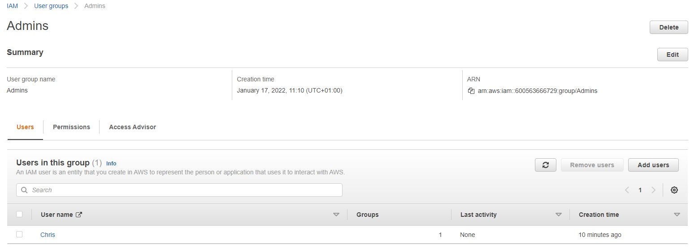
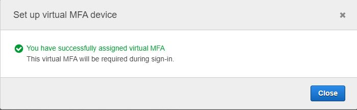

# Identity and Access Management
Individuele en groepstoegang tot uw AWS resources kan veilig worden beheerd met IAM. U kunt gebruikers-ID's aanmaken en onderhouden (ook bekend als "IAM-gebruikers"), en hen autorisatie verlenen voor toegang tot uw bronnen. Buiten AWS, kunt u ook rechten toekennen aan gebruikers (federatieve gebruikers).

## Key-terms

- **IAM** = Identiteit en toegangsbeheer
- **MFA** = Multi-factor authenticatie
- **IAM USERS** = Een IAM-gebruiker is een entiteit die een persoon of dienst vertegenwoordigt.
- **Groups** = Groepen zijn verzamelingen van gebruikers en er zijn beleidsregels aan verbonden.
- **Roles** = Rollen worden aangemaakt en vervolgens "aangenomen" door vertrouwde entiteiten en definiëren een set van permissies voor het doen van AWS service requests.
- **Policies** = Beleidsregels zijn documenten die permissies definiëren en kunnen worden toegepast op gebruikers, groepen en rollen.
- **STS** = De AWS Security Token Service (STS) is een webservice waarmee u tijdelijke inloggegevens met beperkte rechten kunt aanvragen voor IAM-gebruikers of voor gebruikers die u authenticeert (federatieve gebruikers).

## Opdracht

- Oefening 1: individuele Account gebruiker instellen.
- Oefening 2: Multi-Factor Authenticatie (MFA) instellen.
- Oefening 3: IAM-wachtwoordbeleid instellen.

### Gebruikte bronnen

- [What is IAM?](https://docs.aws.amazon.com/IAM/latest/UserGuide/introduction.html)
- [AWS IAM Tutorial](https://www.youtube.com/watch?v=3y596T1eH_8)
### Ervaren problemen

### Resultaat

#### Oefening 1: individuele Account gebruiker instellen.

#### Oefening 2: Multi-Factor Authenticatie (MFA) instellen.

#### Oefening 3: IAM-wachtwoordbeleid instellen.

