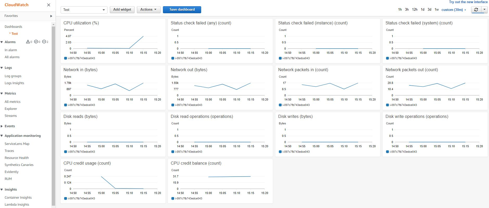
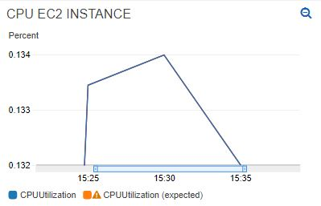
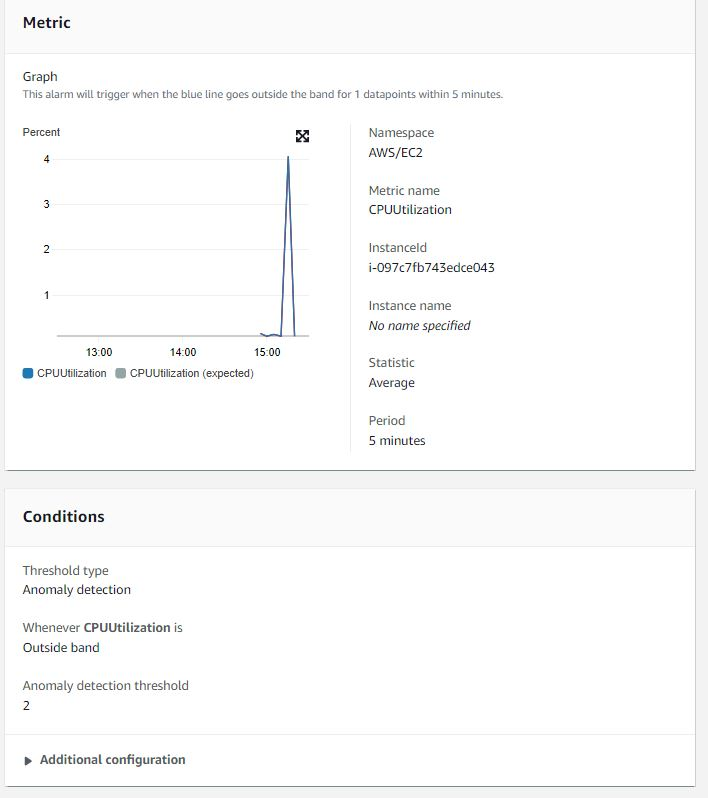
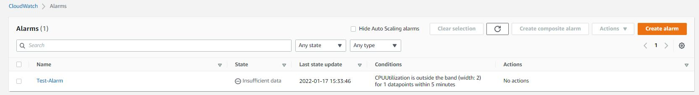

# AWS Cloudwatch
Amazon CloudWatch is een bewakingsdienst voor cloudbronnen en -toepassingen van Amazon Web Services (AWS). Amazon CloudWatch kan worden gebruikt om gegevens te verzamelen en bij te houden, logbestanden te monitoren en alarmen te genereren. Amazon CloudWatch kan AWS-bronnen zoals Amazon EC2-instanties, Amazon DynamoDB-tabellen en Amazon RDS DB-instanties bewaken, evenals aangepaste metrics en logbestanden die door uw applicaties en services worden gegenereerd. U kunt Amazon CloudWatch gebruiken om het gebruik van resources, de prestaties van applicaties en de operationele gezondheid van uw hele systeem te monitoren. Deze inzichten kunnen u helpen te reageren en uw app soepel te laten werken.

## Key-terms

## Opdracht

- Oefening 1: Voeg een ec2 Instance aan een Dasboard.
- Oefening 2: creëer een costume Dasboard in CloudWatch.
- Oefening 3: Maak in CloudWatch een alarm.

### Gebruikte bronnen
- [How Amazon CloudWatch works](https://docs.aws.amazon.com/AmazonCloudWatch/latest/monitoring/cloudwatch_architecture.html)
- [Monitor AWS Resources Using Amazon CloudWatch Dashboards](https://www.youtube.com/watch?v=I7EFLChc07M)

### Ervaren problemen

### Resultaat

#### Oefening 1: Voeg een ec2 Instance aan een Dasboard.

#### Oefening 2: creëer een costume Dasboard in CloudWatch.

#### Oefening 3: Maak in CloudWatch een alarm.

