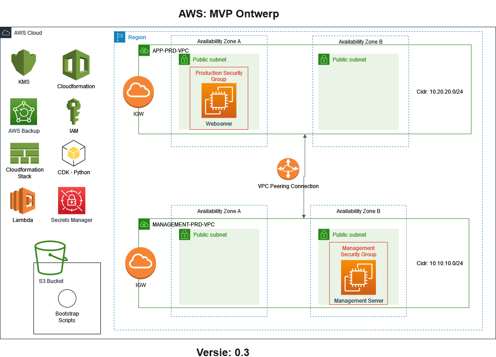

# Product Requirements Document
## Cloud6.Sentia1
- Shikha Jha
- Chris de Bont
- Henk van der Duim (Scrum Master)

## Product Owner
- Coen Meulenkamp (Learning Coach)

## Inhoud
1. Doel
2. Release
3. Epics
4. Diagrammen

### Uitwerking
1. **Doel**  
   | Item       | Opmerking                                                                                          |
   | ---------- | -------------------------------------------------------------------------------------------------- |
   | Visie      | Transitie naar de Cloud                                                             |
   | Doelen     | Eisen, aannames en een werkende MVP v1.0 opleveren. |
   |            | 25-02-2022 voortgangsrapportage MVP v1.0                                                      |
   |            | 11-03-2022 oplevering MVP v1.0                                                                |
   | Persona(s) | Product Owner, DevOps Team                                                                         |

2. **Releases**  
   | Item             | Opmerking                                                                  |
   | ---------------- | -------------------------------------------------------------------------- |
   | Release          | MVP v1.0                                                                   |
   | Datum            | 11-03-2022                                                                 |
   | Initiatief       | Transitie van de infrastructuur naar de cloud                              |
   | Mijlpalen        | 25-02-2022 Tussentijdse voortgangsrapportage MVP v1.0                      |
   |                  | 11-03-2022 Oplevering/rapportage MVP v1.0                                  |
   | Kenmerken        | Omgeving voor de Admin server en een gescheiden omgeving voor de Webserver |
   | Afhankelijkheden | IaC, Python, AWs CDK, eisen Product Owner                                  |
  
3. **Epics**  
   [Epic document.](../07_Project/Epic%20Document.md).
  
4. **Diagrammen**  
  

