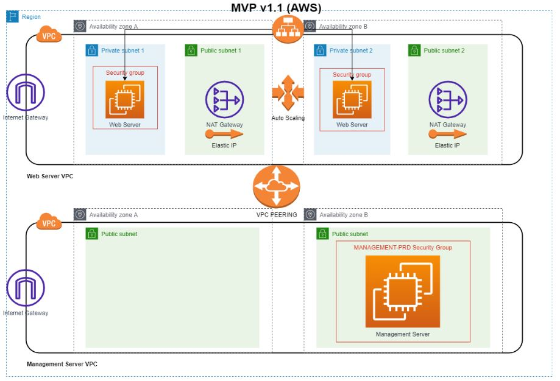

# Product Requirements Document v1.1
## Cloud6.Sentia1
- Shikha Jha
- Chris de Bont
- Henk van der Duim (Scrum Master)

## Product Owner
- Coen Meulenkamp (Learning Coach)

## Inhoud
1. Doel
2. Release
3. Epics
4. Diagrammen

### Uitwerking
1. **Doel**  
   | Item       | Opmerking                                                                                          |
   | ---------- | -------------------------------------------------------------------------------------------------- |
   | Visie      | MPV v1.1 aanpassingen/aanvullingen van de klant                                             |
   | Doelen     | Opleveren van een werkende MVP v1.1 script. |
   | Persona(s) | Product Owner, DevOps Team                                                                         |

2. **Releases**  
   | Item             | Opmerking                                             |
   | ---------------- | ----------------------------------------------------- |
   | Release          | MVP v1.1                                              |
   | Datum            | 08-04-2022                                            |
   | Initiatief       | Aanpassingen/aanvullingen op MVP v1.0                 |
   | Mijlpalen        | 25-03-2022 Tussentijdse voortgangsrapportage MVP v1.1 |
   |                  | 08-04-2022 MVP v1.1 opgeleverd     |
   | Kenmerken        | Aanpassingen zijn vooral gericht op de Webserver omgeving       |
   | Afhankelijkheden | IaC, Python, AWs CDK, eisen Product Owner             |

3. **Diagrammen**  

