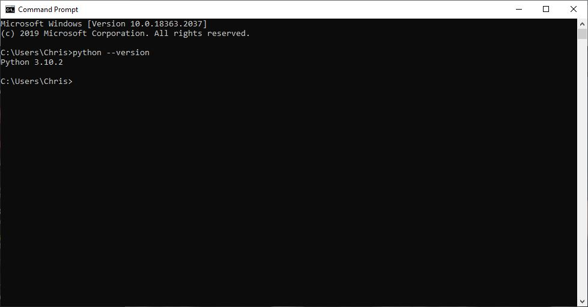
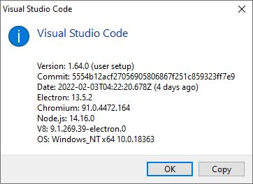
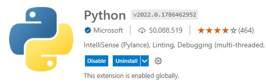
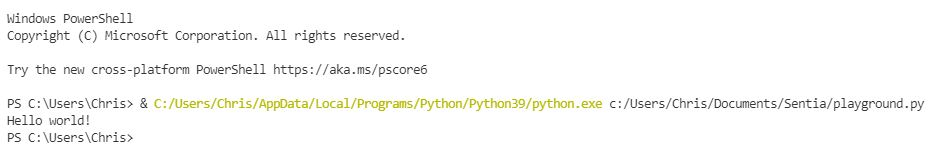

# Setting up
Een basiskennis van programmeren is noodzakelijk voor veel IT-functies. U hoeft niet in staat te zijn om geavanceerde algoritmen te creëren of scripts vanaf nul te schrijven. U moet in staat zijn codefragmenten te begrijpen en aan te passen om aan uw eisen te voldoen.
Het is van cruciaal belang dat u de grondbeginselen van het programmeren begrijpt om dit te kunnen doen. Python wordt soms beschouwd als de gemakkelijkste programmeertaal om te leren door zijn eenvoudige syntaxis.
Zorg ervoor dat u Python toevoegt aan uw PATH variabele wanneer u Python installeert (zelfs als u op Windows zit).

Je hebt een IDE nodig om te beginnen met het schrijven van code. Visual Studio Code (VS Code) is de meest populaire IDE, omdat het gratis is, licht van gewicht, gemakkelijk te gebruiken, en een groot aantal plug-ins heeft.

## Key-terms

## Opdracht

### Oefening:
- Installeer de laatste versie van Python van https://www.python.org/
- Installeer VS Code van https://code.visualstudio.com/download
- Installeer de Python plug-in in VS Code.
- De uitvoer in de terminal zou de tekst "Hello world!" moeten zijn.
### Gebruikte bronnen

- [Python](https://www.python.org/downloads/)
- [Visual Studio Code](https://code.visualstudio.com/download)

### Ervaren problemen

### Resultaat

#### Installeer de laatste versie van Python van https://www.python.org/

#### Installeer VS Code van https://code.visualstudio.com/download

#### Installeer de Python plug-in in VS Code.

#### De uitvoer in de terminal zou de tekst "Hello world!" moeten zijn.

