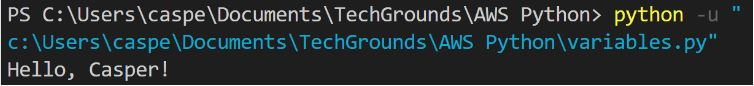

# Variables
Een waarde kan worden opgeslagen in een variabele. De naam van de variabele in de code kan dan worden gebruikt om deze waarde te verkrijgen. Dit is handig als u een waarde wilt hergebruiken of als u de waarde dynamisch wilt wijzigen.

Elke tekenreeks kan gebruikt worden als variabelenaam (behalve enkele speciale gevallen die gereserveerd zijn voor ander gebruik). Het is het beste om variabelen een naam te geven die zowel kort als ondubbelzinnig is. Een variabele die gebruikersinvoer opslaat, bijvoorbeeld, zou input of usr inpt kunnen heten.

Vergeet niet dat je een print statement kan gebruiken om de huidige waarde van een variabele te lezen op elk punt in de code. Wanneer je een bug in een script probeert op te sporen, komt dit van pas.

## Key-terms

## Opdracht

### Oefening 1:
- Maak een nieuw script.
- Maak twee variabelen x en y. Ken aan beide variabelen een numerieke waarde toe.
- Druk de waarden van x en y af.
- Maak een derde variabele z. De waarde van z moet de som zijn van x en y.
- Druk de waarde van z af.

### Oefening 2:
- Maak een nieuw script.
- Maak een variabele name. De waarde van name moet uw naam zijn.
- Druk de tekst "Hello, <your name here>!" af. Gebruik naam in de printopdracht.
- Voorbeeld output:

### Oefening 3:
- Maak een nieuw script.
- Maak een variabele en wijs er een waarde aan toe.
- Print de tekst "Value 1: <Value 1 here>".
- Verander de waarde van diezelfde variabele.
- Print de tekst "Value 2: <Value 2 here>".
- Wijzig de waarde van diezelfde variabele.

### Gebruikte bronnen

### Ervaren problemen

### Resultaat
