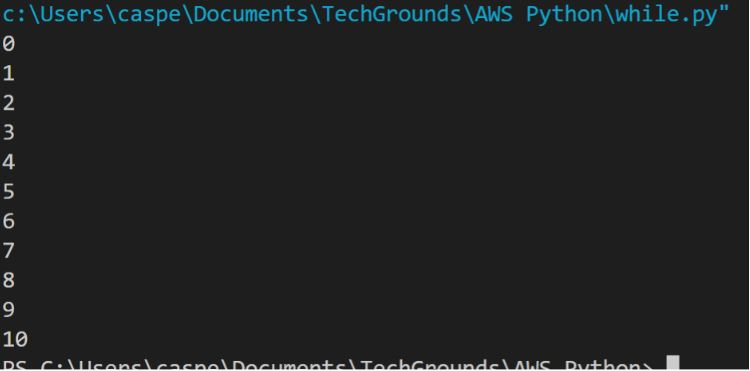
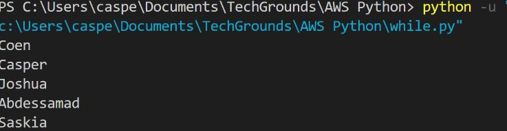

# Loops
Wanneer u een deel van de code verschillende keren wilt uitvoeren, kunt u lussen gebruiken. Je zou bijvoorbeeld een bewerking willen uitvoeren op elk item in een (lange) lijst, of een algoritme ontwerpen dat dezelfde set instructies steeds herhaalt.
De while lus en de for lus zijn de twee types van lussen in Python.
Zolang een voorwaarde waar is, voert de while lus uit. Als die voorwaarde nooit verandert, kunnen ze eindeloos doorlopen. Als je programma vastzit in een oneindige lus, klik je gewoon op ctrl-c (of command-c op MacOS) om het te stoppen.
De for-lus itereert een opgegeven aantal keren. De range() functie kan gebruikt worden om dit aantal hard te maken, of het kan dynamisch gegenereerd worden.

## Key-terms

## Opdracht

### Oefening 1:
- Maak een nieuw script.
- Maak een variabele x en geef die de waarde 0.
- Gebruik een while-lus om de waarde van x in elke iteratie van de lus af te drukken. Na het afdrukken moet de waarde van x toenemen met 1. De lus moet blijven lopen zolang x kleiner is dan of gelijk aan 10.
- Voorbeeld output:



### Oefening 2:
- Maak een nieuw script.
- Kopieer de onderstaande code in je script.

      for i in range(10):
          # do something here
- Print de waarde van i in de for-lus. Je hebt niet handmatig een waarde aan i toegekend. Zoek uit hoe de waarde wordt bepaald.
- Voeg een variabele x toe met waarde 5 bovenaan je script.
- Print met behulp van de for-lus de waarde van x vermenigvuldigd met de waarde van i, voor maximaal 50 iteraties.

### Oefening 3:
- Maak een nieuw script.
- Kopieer de onderstaande array in je script.

      arr = ["Coen", "Casper", "Joshua", "Abdessamad", "Saskia"]
- Gebruik een for-lus om over de array te lopen. Druk elke naam afzonderlijk af.
- Voorbeeld output:


### Gebruikte bronnen

### Ervaren problemen

### Resultaat

#### Oefening 1:

```Python
x = 0
while x < 10:
    x += 1
    print(x)
```

#### Oefening 2:
```Python
x = 5
for i in range(50):
    print(x*i)
```

#### Oefening 3:
```Python
arr = ["Coen", "Casper", "Joshua", "Abdessamad", "Saskia"]
for i in arr:
    print(i)
```