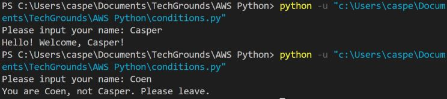
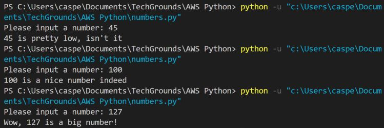

# Conditions
U zult vaak een stuk code alleen willen uitvoeren als aan bepaalde criteria is voldaan. Je zou bijvoorbeeld alleen naar een foutenlogboek willen schrijven als er een fout optreedt.
De ```if```, ```elif```, en ```else``` commando's worden gebruikt in Python.

## Key-terms


## Opdracht

### Oefening 1:
- Maak een nieuw script.
- Gebruik de functie input() om de gebruiker van je script om zijn naam te vragen. Als de naam die ze invoeren jouw naam is, druk dan een persoonlijke welkomstboodschap af. Zo niet, druk dan een andere persoonlijke boodschap af.
- Voorbeeld uitvoer:




### Oefening 2:
- Maak een nieuw script.
- Vraag de gebruiker van je script om een getal. Geef hem een antwoord op basis van of het getal hoger is dan, lager is dan, of gelijk is aan 100.
- Voorbeeld output:



Laat het spel herhalen totdat de gebruiker 100 invoert.


### Gebruikte bronnen

### Ervaren problemen

### Resultaat
