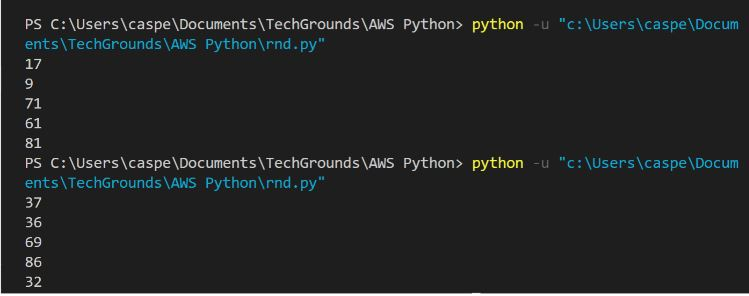
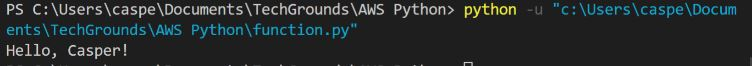

# Functions
Verschillende functies, zoals ```print()``` en ```input()```, zijn reeds bekeken en gebruikt (). Een functie is een stuk code dat alleen wordt uitgevoerd wanneer het wordt aangeroepen. De haakjes () naast de functienaam identificeren het als een functie. Deze haakjes worden gebruikt om gegevens aan een functie te verstrekken.
Als gevolg daarvan kunnen functies gegevens teruggeven.

U kunt aangepaste functies schrijven of functies importeren uit een bibliotheek of pakket, naast de ingebouwde functies.
## Key-terms

- **Function** = Functions are "self contained" modules of code that accomplish a specific task.

## Opdracht

### Oefening 1:
- Maak een nieuw script.
- Importeer het random pakket.
- Druk 5 willekeurige gehele getallen af met een waarde tussen 0 en 100.
- Voorbeeld uitvoer:



### Oefening 2:
- Maak een nieuw script.
- Schrijf een aangepaste functie myfunction() die "Hallo, wereld!" naar de terminal afdrukt. Roep myfunction aan.
- Herschrijf je functie zo dat het een string als argument neemt. Dan moet hij "Hallo, <string>!" afdrukken.
- Voorbeeld uitvoer:



### Oefening 3:
- Maak een nieuw script.
- Kopieer de onderstaande code in je script.

      def avg():
          # write your code here
 
      x = 128
      y = 255
      z = avg(x,y)
      print ("The average of",x,"and", y, "is", z)
Schrijf de aangepaste functie avg() zo dat het het gemiddelde van de gegeven parameters teruggeeft.

### Gebruikte bronnen

### Ervaren problemen

### Resultaat

#### Oefening 1:

```Python
import random

for i in range(5):
    rnd = random.randint(0, 100)
    print(rnd)
```

#### Oefening 2:
```Python
name = "Chris"

def myfunction(string):
    print("Hello,", string + "!")

myfunction(name)
```
#### Oefening 3:

```Python
def avg():
    x = 128
    y = 255
    z = (x + y) / 2
    print("The average of", x, "and", y, "is", z)
avg()
```