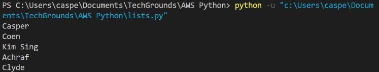
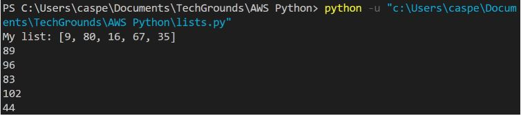

# Lists
In een enkele variabele kunt u een lijst van waarden declareren. Een lijst wordt aangeduid met vierkante haken [], met een komma als scheidingsteken tussen elke waarde.

De index is een getal dat verbonden is met elke plaats in een lijst. Omdat indexen beginnen bij nul, zal het eerste item in een lijst ook de index 0 hebben. Het tweede item zal de index 1 krijgen, enzovoort. Afzonderlijke elementen in een lijst kunnen worden benaderd door de index te gebruiken.

Een for-lus kan worden gebruikt om door een lijst te lopen. In plaats van een getal binnen een bereik, zal de waarde van een item in de lijst worden opgeslagen in I (of welke naam je ook geeft aan de variabele die je definieert). Je kan nog steeds door een lijst lopen met range(). In dit geval,
## Key-terms


## Opdracht

### Oefening 1:
- Maak een nieuw script.
- Maak een variabele die een lijst van vijf namen bevat.
- Loop door de lijst met behulp van een for-lus. Druk elke individuele naam in de lijst af op een nieuwe regel.
- Voorbeeld uitvoer:



### Oefening 2:
- Maak een nieuw script.
- Maak een lijst van vijf gehele getallen.
- Gebruik een for-lus om het volgende te doen voor elk item in de lijst:
- Print de waarde van dat item opgeteld bij de waarde van het volgende item in de lijst. Als het het laatste item is, voeg het dan toe aan de waarde van het eerste item (aangezien er geen volgend item is).
- Voorbeeld output:



- Het eerste resultaat hierboven is gemaakt door 9 en 80 op te tellen. Het tweede resultaat is gemaakt door 80 en 16 op te tellen, enz. Het laatste resultaat is gemaakt door 35 en 9 op te tellen.


### Gebruikte bronnen

### Ervaren problemen

### Resultaat

#### Oefening 1:

```python
lijst = ["Casper", "Coen", "Kim Sing", "Achraf", "Clyde"]

for i in lijst:
    print(i)
```

#### Oefening 2:

```python
lijst = [9, 80, 16, 67, 35]

for i in range(len(lijst)):
    if i == len(lijst)-1:
        print(lijst[i] + lijst[0])
    else:
        print(lijst[i] + lijst[i+1])
```